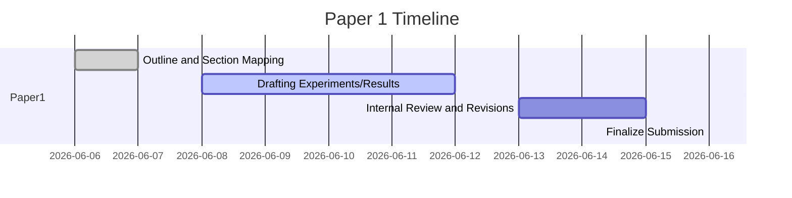

# Executive Summary  
We propose splitting the original manuscript into **Paper 1** (HPA failure analysis) and **Paper 2** (the connection‐aware solution and extensions). Paper 1 will **include** all content up to and including the characterization experiments (Sections 1–4 in the original). It will **exclude** the custom controller design, baseline comparisons beyond HPA, MQTT extension, and related discussion (to Paper 2). Below is a detailed outline for Paper 1, including rewritten abstract, scope, section/figure mappings, figure priorities, and editorial guidance for a self-contained narrative focused solely on CPU‐based HPA failure for stateful WebSocket workloads.

## Abstract (concise)  
*Kubernetes’ default HPA uses CPU utilization to autoscale stateless services, but this signal breaks for stateful WebSocket workloads. We present a systematic empirical study of CPU‐based HPA under WebSocket load. In a series of controlled experiments, we observe severe failure modes: cyclical load causes 87.5% over‐provisioning, scaledown events trigger reconnection storms (~1,400 conn/s), and idle‐connection scale‐down irrecoverably loses active sessions. These results establish that CPU alone is a misleading proxy for persistent connections. Our work documents these failure modes in detail (with reproducible artifacts) and motivates the need for connection‐aware scaling.*/  
**Keywords:** Kubernetes HPA, stateful workloads, WebSocket, autoscaling, reconnection storm, over-provisioning.

## Motivation & Research Questions  
- **Context:** Modern cloud services often maintain long‐lived connections (WebSockets, gRPC, MQTT). Kubernetes HPA, by design, scales on short‐term CPU metrics, assuming stateless HTTP request patterns. We hypothesize this mismatch causes harmful behavior under persistent‐connection loads.  
- **Research Questions:**  
  1. *How does CPU‐based HPA behave under WebSocket workloads?* (Specifically: does it correctly match capacity to  sessions?)  
  2. *What failure modes arise when HPA scales down pods hosting idle but connected sessions?* (Quantify over‐provisioning, reconnection storms, and session loss.)  
  3. *What is the causal chain linking HPA decisions to client‐perceived disruptions?*  

## Scope and Exclusions  
**Included:** Sections illustrating HPA’s baseline behavior (Introduction & Background), and all four progressive experiments (A–B3) characterizing HPA failures. All figures and results relating to these experiments (replica timelines, reconnection rates, active‐connection counts) will be retained. The comparative summary table (Table 1) remains.  
**Excluded (for Paper 1):** Anything about the custom connection‐aware controller (Section 5 onward), KEDA or alternative autoscalers, MQTT broker experiments, and broad future work. We explicitly defer discussion of solution design to Paper 2. In particular, do **not** include the StatefulAutoscaler CRD, Experiments C–E, or Section 8–13 content; these will be Paper 2. Related Work and Discussion sections will be trimmed to focus on autoscaler architecture and known challenges, omitting solution-oriented citations (they belong in Paper 2).

## Content Mapping (Original → Paper 1)  

| Original Section/Figure         | Paper 1 Section/Figure         | Action                            |
|---------------------------------|-------------------------------|-----------------------------------|
| **Sec 1: Introduction**         | Sec 1: Introduction           | **Keep**, but remove text about our controller and MQTT; end with statement of the HPA scaling problem under stateful load. |
| **Sec 2: Related Work**         | Sec 2: Related Work (condense) | **Condense** to focus on HPA architecture and stateful autoscaling challenges; remove references to KEDA or controller work. |
| **Sec 3: Background: HPA**      | Sec 3: Background (HPA)       | **Keep** core description of HPA (proportional control law, Fig.1 summary maybe) but omit baseline stateless results. *Alternatively*, merge key HPA architecture points into Intro. |
| **Sec 4: HPA Failure (Exp. A–B3)** | Sec 4: Experiments          | **Keep in full**. All Experiment A, B1, B2, B3 subsections remain, as written (these show HPA failure).  Retain their figures and analysis.  |
| – Fig.5 (Exp A replicas)        | Fig.1 in Paper 1              | **Keep (rename)**. Shows ideal HPA scaling under proportional load (baseline). |
| – Fig.6 (Exp B1 replicas)       | Fig.2 in Paper 1              | **Keep**. Shows severe overprovisioning to max. |
| – Fig.7 (Exp B2 reconnections)  | Fig.3 in Paper 1              | **Keep**. Reconnection rate spikes. |
| – Fig.8 (Exp B2 connections)    | Fig.4 in Paper 1              | **Keep**. Active‐connection overshoot. |
| – Fig.9 (Exp B2 HPA vs conn)    | Fig.5 in Paper 1              | **Keep**. Correlation of scale events with reconnections. |
| – Fig.10 (Exp B3 connections)   | Fig.6 in Paper 1              | **Keep**. Staircase drop in active connections. |
| – Fig.11 (Exp B3 combined)      | Fig.7 in Paper 1              | **Keep**. Combined CPU/replica/connection timeline. |
| **Table 1 (failure summary)**   | Table 1 in Paper 1            | **Keep**. Summarizes each failure mode. |
| **Sec 5+: Solution/Controller** | –                             | **Delete** (move to Paper 2). |
| **Sec 6–9: Experiments C–E**    | –                             | **Delete** (Paper 2). |
| **Sec 10: Discussion (only HPA part)** | –                    | **Omit** or **condense** strictly to implications of failure. (Solution discussion to Paper 2.) |
| **Sec 11–13: Extensions/Future** | –                            | **Delete** (Paper 2). |
| **Figures 1–4 (baseline)**      | –                             | **Delete** (not needed). |
| **Figures/Tables from Paper2**  | –                             | **Exclude**. |

## Figures/Tables to Include  

1. **Table 1 (Summary of failure modes):** Keep as Table 1. Captures all key results succinctly.  
2. **Figure 1 (Experiment A – Replica count):** Shows correct scaling under ideal load (for baseline reference). Caption: “HPA correctly scales replicas when CPU∝connections (monotonic load).”  
3. **Figure 2 (Experiment B1 – Replica count):**  Demonstrates oscillation to maxReplicas (87.5% overprovision). Caption: “HPA saturates at maxReplicas under cyclical load, causing 87.5% overprovision.”  
4. **Figure 3 (Experiment B2 – Reconnection rate):**  Peaks ~1400 conn/s. Caption: “Reconnection storm rate (clients/s) aligned with each scale-down.”  
5. **Figure 4 (Experiment B2 – Active connections):**  Shows temporary overshoot above 800. Caption: “Active connections overshoot the steady-state target (51.9%) during reconnections.”  
6. **Figure 5 (Experiment B2 – HPA vs connections):**  Overlay of HPA replicas and connections. Caption: “Scale-down decision (green step) causes  abrupt drop in connections (blue).”  
7. **Figure 6 (Experiment B3 – Active connections):**  “Staircase” decline in live connections (from 800 to 79) when clients do *not* reconnect. Caption: “Permanent loss of sessions: connections (blue) fall in steps as each pod is killed.”  
8. **Figure 7 (Experiment B3 – Combined signals):**  Overlaid CPU (red), replicas (green), and connections (blue) time-series. Caption: “HPA scale-down (green) driven by near-zero CPU (red) completely destroys connections (blue).”  

*Justification:* These figures cover all HPA failure aspects (correct baseline, overshoot, storm, loss). Any other figures (baseline CPU profiles, controller evaluation, etc.) are omitted. Axis labels should explicitly include units (e.g. “Connections”, “Replication count”, “Time (s)”). No new figures are needed beyond minor label tweaks.

## Recommended Edits  

- **Introduction:**  Remove or rewrite paragraphs about the custom solution, contributions beyond failure analysis, and any mention of controllers/Kubebuilder. Focus the intro on the *problem*: the CPU‐vs‐connection mismatch. End with clear research questions or a statement like “We systematically investigate HPA under WebSocket loads.”  
- **Related Work:** Trim background on KEDA and predictive autoscaling; concentrate on prior HPA analyses and any mention that stateful protocols are known challenges (e.g. cite Dickel et al. if possible).  
- **Background (HPA):** Keep the description of the HPA control law (Equation 1) and Fig.1 concept if needed, but cut the lengthy baseline experiments on stateless load. Possibly move any necessary HPA overview into Related Work or Motivation.  
- **Experiments (Sec 4):**   Largely retain as-is. You may condense narrative (combine Cyclic load experiment summary into one paragraph rather than separate A/B1). Omit detailed configuration (they can be summarized in Methods). Highlight quantitative results (87.5%, 1,400 conn/s, 91% loss).  
- **Table 1:** Keep verbatim.  
- **Any references** to controller design, Prometheus Adapter config, KEDA cooldown, etc., should be deleted. Likewise remove all code/CRD discussion.  
- **Conclusion (for Paper 1):** Redraft to summarize only the failure findings and implications. For example: “In this study we have shown X, Y, Z.  These findings imply that CPU‐based HPA is unsafe for WebSocket services. A connection-aware approach is needed (see companion paper).”  

## Experiments & Metrics (to keep or add)  
All four experiments from the original (A–B3) are retained. We suggest explicitly reporting mean ± std for key metrics across cycles or runs to strengthen statistical confidence:  
- *Over-provisioning (Exp B1):* It is measured as (15–8)/8 = 87.5%.  Report as “HPA used 15 vs. optimal 8 pods.”  
- *Reconnection Rate (Exp B2):* Compute mean and std of the peak rate across cycles (≈1338 ± 75 conn/s). This reinforces consistency.  
- *Connection loss (Exp B3):* State the percentage of sessions destroyed (e.g., 91.3% lost). Possibly run an extra replicate to confirm.  
- Consider adding a short statistical test (e.g. t-test) if comparing HPA’s overshoot vs. ideal—though descriptive stats may suffice here.  
All experiment parameters (client count, durations, CPU_work, etc.) remain as in original, and are documented in Methods.

## Reproducibility Checklist  
- **Code & Repo:** Include link to the GitHub repository (the paper’s `STAR` repo). Cite that all experiment scripts are under `scripts/`.  
- **Cluster Config:** Kind v0.25.0, Kubernetes v1.31.6 (1 control-plane + 2 workers, as in `kind.yml`).  
- **Metrics Server:** Installed with flags `--metric-resolution=15s --kubelet-insecure-tls` (needed for self-signed kubelets in Kind).  
- **Prometheus:** Configured with a 15 s scrape interval for the `active_connections` metric.  
- **HPA YAML:** `minReplicas=2, maxReplicas=15, targetCPUUtilization=60%` (for all experiments).  
- **Server Image:** Custom WebSocket server exposing `active_connections` and `new_connections_total` (e.g. `ws-instrumented` image).  
- **Load Scripts:** e.g. `scripts/run-experiment-{a,b1,b2,b3}.sh` with parameters `CPU_WORK=1 or 0`, `PING`, `DROP` durations as originally specified (800 clients, 60s HIGH/30s LOW cycles, etc.).  
- **Data Collection:** Specify Prometheus queries (e.g. `rate(new_connections_total[15s])`, `active_connections`) and how figures are generated.  
- **Hardware:** (Optional) Note that experiments ran on a single-machine (or VM) with sufficient resources; CPU results were <200m in all cases.  
- **Randomness:** Each experiment is deterministic except network scheduling; repeating cycles (as in B2’s five runs) is recommended to validate consistency.

## Suggested Venues & Style  
**Venues:** This focused study could target a systems or cloud‐computing venue. Candidates include *IEEE Trans. on Services Computing*, *IEEE Trans. on Network & Service Management*, *ACM Symp. on Cloud Computing (SoCC)*, or *Middleware* conference (short paper). A specialized workshop (e.g., *Autonomic Computing* or *Cloud Native Services*) is also fitting.  
**Page/Figure Budgets:** Aim for ~8–10 pages (two-column) including 7 figures and 1 table, plus references. Keep narrative concise. Typically, journals allow ~10-12 pages; conferences ~6-8 pages. If needed, we can shorten Fig.5 (Exp A) and combine some plots, but clarity is paramount.  

## Proposed Title/Abstract/Keywords  
- **Title:** “Empirical Failure Analysis of CPU‐based Kubernetes HPA for WebSocket Workloads”  
- **Abstract:** *(as above in Abstract section)*.  
- **Keywords:** Kubernetes, Horizontal Pod Autoscaler, Stateful Workloads, WebSocket, Connection‐aware Scaling, Reconnection Storm, Autoscaling Failure.

## Related Work (prioritization)  
Focus citations on:  
- **HPA architecture:** e.g. official Kubernetes HPA docs, and Nguyen et al. (2020) for HPA dynamics.  
- **Stateful scaling challenges:** Dickel et al. (2019) on IoT/WebSocket autoscaling, and any works on WebSocket load balancing.  
- **Custom-metric autoscaling:** Mention Prometheus Adapter usage and KEDA generally (without details).  
- Omit or minimize unrelated works (e.g., predictive scaling, RL methods, or any new primitives). The goal is to contextualize *why* the HPA assumption fails, not to review all scaling literature.

## Paper 2 Cross-References  
- **In Paper 1:** Conclude with a forward pointer: e.g. “We leave the design of a corrective solution (connection-aware scaling) to a companion paper.” Do not detail it here.  
- **In Paper 2:** Add an introductory sentence: “In prior work [Paper 1], we empirically demonstrated that CPU‐based HPA catastrophically fails under persistent WebSocket load. We now address these failures by...”  
Use phrasing like “as shown in this paper” for Paper 2 and “companion paper” or “[24]” as needed (assuming Paper 1 is reference in Paper 2’s submission).

## Assumptions & Open Questions  
- We **assume** default Kubernetes pod termination: 30s grace period (SIGTERM then SIGKILL). We did not explore varying `terminationGracePeriodSeconds`; all results use the default (discussed in Paper 2 Limitations).  
- We assume clients immediately detect RSTs (no hidden network queue) and do not naturally retry (Exp B3 uses `reconnect:false`). In real deployments, many clients *do* reconnect. This assumption was deliberate to quantify *permanent* loss; impacts of real reconnection logic are deferred to Paper 2.  
- The workload is synthetic (ping-based) with fixed idle periods. In a live app, occasional CPU spikes may occur even with idle WebSockets; this could slightly alter HPA behavior. We do not address that variation here.  
- **Open:** How do multi-node or heterogeneous clusters affect the dynamics? Our Kind setup had uniform nodes. Also, we assume synchronous client behavior; real user behavior could smooth reconnections or inject jitter. These are left for future empirical study.

## Git Workflow & Self-Plagiarism Checklist  
- **Branches:** Create a `paper1_split` branch from the main draft. Develop Paper 1 there.  
- **Commits:** Use messages like “Paper1: Keep HPA failure sections, remove solution content” or “Paper1: Cut KEDA references; focus on reconnection experiments.”  
- **Self-plagiarism:** When reusing results or phrasing from the original:  
  - **Rewrite** all text describing experiments in new words.  
  - **Cite** original data or figure (e.g. “(adapted from our prior work)”) if absolutely necessary, or better, rephrase as new analysis of the same data.  
  - **Check overlap:** Do not copy consecutive sentences from the original manuscript. Use synonyms and reorganize paragraphs.  
  - **Cross-cite:** If any summary statements are reused, reframe as “We found that … [Paper1]” or similar.  
  - **Check introduction:** Ensure any background text not identical. When in doubt, cite sources rather than copying.

By following this plan, **Paper 1** becomes a concise, self-contained study of HPA’s failure modes, setting up the need for Paper 2’s solution.