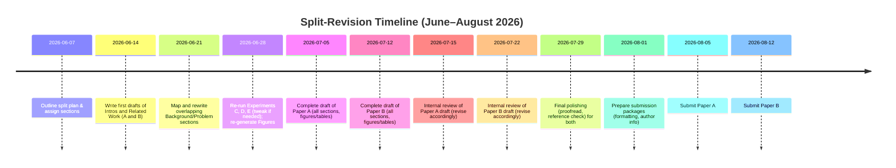

split-plan.md

# Executive Summary  
- **Two distinct papers** will be extracted from the original manuscript:  
  - **Paper A:** *“Characterizing HPA Failure Modes for Stateful WebSocket Workloads.”* Focuses on empirical failure modes of CPU-driven autoscaling (Experiments A–B3).  
  - **Paper B:** *“Connection-Aware Autoscaling in Kubernetes: A Custom Controller.”* Focuses on the design and evaluation of the StatefulAutoscaler (Experiments C–MQTT).  
- Each paper will have its own coherent narrative and contributions. Overlapping content (e.g. motivation, HPA background) will be rewritten to emphasize the unique angle of each paper, avoiding text reuse.  
- A detailed section and figure mapping ensures no duplication. Common intro/background ideas will be retold differently in each paper.  
- We provide a timeline for rewriting and review, suggestions for target venues, guidance on ethical disclosure, and a checklist to manage the split and submission.

## (1) Paper Titles and Abstracts  
**Paper A Title:** *“Empirical Characterization of Kubernetes HPA Failure Modes for Stateful WebSocket Workloads.”*  
**Paper A Abstract (2–3 sentences):** This paper **systematically quantifies the failure modes** of Kubernetes’ CPU-based Horizontal Pod Autoscaler (HPA) under persistent WebSocket traffic. Through a chain of controlled experiments (A–B3), we demonstrate severe over-provisioning, reconnection storm peaks (∼1,400 conn/sec), and irrecoverable session losses due to idle-connection scale-down. Our results motivate the need for new autoscaling strategies.  

**Paper B Title:** *“Connection-Aware Autoscaling in Kubernetes: Design and Validation of a Stateful WebSocket Controller.”*  
**Paper B Abstract (2–3 sentences):** Building on the failure analysis, this paper **introduces and evaluates** the *StatefulAutoscaler*, a custom Kubernetes controller that scales on live connection count with a slide-window cooldown. We describe its design, implementation, and two-cycle WebSocket experiments (C, D, E) demonstrating exact scaling (no waste), zero connection loss, and resilience to metric outages. Comparative baselines (HPA+custom metrics, KEDA) and an MQTT extension further validate this connection-aware approach.  

*Note:* These abstracts emphasize distinct contributions (Paper A: *failure analysis*; Paper B: *controller solution*). 

## (2) Section-by-Section Mapping and Rationale  
We split the original manuscript’s sections into two papers.  Sections marked **(A)** go in Paper A; **(B)** in Paper B. Shared background elements will be rewritten separately.

| Original Section                                   | Paper A   | Paper B   | Rationale |
|----------------------------------------------------|:---------:|:---------:|-----------|
| **Introduction**                                   | ● (trim)  | ● (trim)  | Both papers need context.  In Paper A, emphasize problem motivation (stateful workloads breaking HPA). In Paper B, emphasize solution overview and cite Paper A (or preprint).  Do not duplicate text. |
| **Related Work**                                   | ● (trim)  | ● (trim)  | Paper A: focus on existing HPA analyses, autoscaling for stateless services, saliency of problem. Paper B: focus on custom metrics, prior controllers, KEDA. Avoid overlapping citations. |
| **Background: Kubernetes Autoscaling Pipelines**    | ● (keep)  | –         | Paper A needs this for context on HPA design (Equation 1 etc.). Paper B can omit or greatly shorten and refer to Paper A for background.  |
| **Problem: Empirical Evidence of HPA Failure**     | ● (all)   | –         | Core content for Paper A. Includes Experiments A, B1, B2 (with instrumentation), B3 (no-reconnect). Tables/figures from these experiments all in Paper A. |
| **Proposed Solution: StatefulAutoscaler Controller**| –         | ● (all)   | Paper B: full section (connection-aware design, CRD). Paper A omits.  |
| **Experimental Evaluation: Experiment C**          | –         | ● (all)   | Paper B: scale-up, drop1, etc. Paper A omits.  |
| **Baseline Comparisons: Exp D & E (Custom HPA, KEDA)** | –     | ● (all)   | Paper B: comparative baselines. Paper A omits.  |
| **Failure Analysis: Adversarial Scenarios**         | –         | ● (all)   | Paper B: metric staleness, spikes, prometheus outage. Paper A omits.  |
| **Discussion**                                      | ● (short) | ● (short) | Paper A discussion: focus on implications of HPA failures (e.g. “the architectural gap”). Paper B discussion: focus on design tradeoffs (e.g. cooldown length, step-size). Keep these distinct. |
| **MQTT Extension: Protocol Generalization**         | –         | ● (all)   | Paper B: a nice extra validation. Paper A omits.  |
| **Limitations**                                     | –         | ● (all)   | Paper B addresses limitations of controller (e.g., scrape lag, crash state). (Paper A’s limitations were mostly “already covered in results.”)  |
| **Future Work**                                     | –         | ● (condense) | Paper B: briefly note next steps. Paper A could omit or cite Paper B for future work. |
| **Conclusion**                                     | ● (concise) | ● (concise) | Each paper concludes with its own final takeaways. Paper A: “HPA fails” summary. Paper B: “connection-aware works” summary.  |
| **Acknowledgements / Data Availability**           | –         | –         | Omit from final paper drafts; instead supply these in a shared appendix or leave for first paper or a combined arXiv release. |

*Rationale:* Paper A tells the *problem* story and ends before the custom controller. Paper B tells the *solution* story and references Paper A’s findings. Overlapping content (intro/motivation) will be rephrased.

## (3) Figures/Tables/Experiments Mapping  

All figures and tables from the original must be assigned to one paper or the other, never duplicated.  Overlapping figures (if any) will be re-generated distinctly or re-labeled.

| Figure/Table (Original Caption)                             | Paper A? | Paper B? | Notes on Reuse/Avoiding Duplication |
|------------------------------------------------------------|:--------:|:--------:|-------------------------------------|
| **Fig. 1:** Standard Kubernetes HPA feedback loop (Nguyen2019) |  Paper A  | –        | Only needed in Paper A to explain HPA architecture. |
| **Fig. 2:** KRM baseline CPU over time                    |  Paper A  | –        | Paper A: HPA acts as expected. (Background experiment) |
| **Fig. 3:** KRM baseline desired vs current replicas      |  Paper A  | –        | Paper A: shows actuation delay, supporting context. |
| **Fig. 4:** PCM scrape-interval comparison                |  Paper A  | –        | Paper A: shows how scrape interval affects HPA (Nguyen2020).|
| **Fig. 5:** Experiment A replica timeline (flat monotonic ascent) |  Paper A  | –  | Paper A: ideal-case HPA baseline. |
| **Fig. 6:** Experiment B1: replicas over cycles (max=15)  |  Paper A  | –        | Paper A: over-provisioning (87.5% waste). |
| **Fig. 7:** Exp B2-Instrumented reconnection rate (conn/s) |  Paper A  | –        | Paper A: reconnection storm peaks (1,400/s). |
| **Fig. 8:** Exp B2-Instrumented active connections (overshoot) |  Paper A  | –      | Paper A: connection overshoot (1,215 vs 800). |
| **Fig. 9:** Exp B2: replicas vs connections (causal)**    |  Paper A  | –        | Paper A: showing scale-down causing connection spikes. (Combined plot from B2) |
| **Fig. 10:** Exp B3 active connections (staircase loss)   |  Paper A  | –        | Paper A: permanent loss steps (800→79). |
| **Fig. 11:** Exp B3 combined signals (CPU, replicas, conns) |  Paper A  | –      | Paper A: final causal proof (blue/green/red plot). |
| **Table 1:** Summary of failure modes (Experiments A–B3)    |  Paper A  | –        | Paper A: synthesizes B1–B3 results. |
| **Fig. 12:** Exp C (StatefulAutoscaler) active connections (two cycles) |  –     | Paper B   | Paper B: connection count over time (flat gap). |
| **Fig. 13:** Exp C replica count timeline (flat-bridge)   |  –        | Paper B   | Paper B: replicas held at 8 through DROP 1 (key result). |
| **Fig. 14:** Exp C combined signals (CPU vs connections vs replicas) |  –     | Paper B   | Paper B: shows connection→replica control (zero CPU). |
| **Fig. 15:** Exp C multi-run (overlaid runs)               |  –        | Paper B   | Paper B: reproducibility (σ=67s pod-sec, etc). |
| **Fig. 16:** Exp D (HPA+custom metrics) multi-run         |  –        | Paper B   | Paper B: five-run overlay (8 replicas held, but slower scale-down). |
| **Fig. 17:** Exp E (KEDA, cooldown=120) multi-run         |  –        | Paper B   | Paper B: five-run overlay (holds 8 replicas through gap, no scale-down observed). |
| **Fig. 18:** Comparison C vs D (side-by-side time series)  |  –        | Paper B   | Paper B: illustrates difference between our controller and HPA+custom. |
| **Fig. 19:** Failure scenarios comparison (staleness, spike, outage) |  –     | Paper B   | Paper B: adversarial tests (graceful degrade). |
| **Fig. 20:** MQTT-A (CPU HPA) connections plot            |  –        | Paper B   | Paper B: MQTT baseline (339→639→339 connections, pinned sessions). |
| **Fig. 21:** MQTT-B (StatefulAutoscaler) plot            |  –        | Paper B   | Paper B: MQTT controlled (proper scaling and drain). |
| **Table 2:** MQTT results comparison (339 sessions HPA vs 339 sessions controller) | – | Paper B | Paper B: summarizing MQTT outcomes (table). |

*Note:* Figures 9 and 11 in original (causal plots) are both in Paper A. Figures 12–21 go in Paper B. No figure is shared. If an experiment appears in both narratives (e.g. comparing C vs D), it is only in Paper B. Overlaps in topic (e.g. KEDA vs custom) are separated by narrative focus.

## (4) Avoiding Text Overlap (Intro/Related/Background)  
To prevent self-plagiarism, **rewrite overlapping sections with different emphasis**. Use these guidelines:

- **Introduction (Paper A vs B):**  
  - *Paper A:* Emphasize the emerging mismatch between traditional CPU-driven autoscaling and persistent-connection workloads. Provide context (WebSocket adoption, Kubernetes HPA defaults). End with a statement of contributions (the empirical evidence chain).  
  - *Paper B:* Emphasize the problem has been characterized (cite “Paper A” as [A] or “prior work”), then pivot to our proposed solution. Focus on the novelty of using connection-count metrics and stabilization. Each intro should cite relevant work differently to avoid identical phrasing.  
- **Related Work:**  
  - *Paper A:* Summarize HPA architecture and known limitations (e.g. Nguyen et al. analysis, cascadic or chaos results). Mention work on WebSocket scaling as motivation. Do **not** discuss our controller here.  
  - *Paper B:* Focus on non-CPU metrics (Prometheus Adapter, KEDA) and prior attempt at connection-based scaling. Discuss related connection-aware triggers (if any exist). Cite HPA studies just briefly or as “see [A]”. Emphasize how prior work leaves out connection-context stabilization.  
- **Background:**  
  - *Paper A:* Include a brief account of HPA control loop and the false assumption (Figure 1 architecture). Provide necessary equations or definitions that are used in Experiments A–B3.  
  - *Paper B:* Only define any terms or pipeline pieces not already covered in Paper A’s background. If needed, reproduce a minimized version of the architecture figure with a new caption focusing on connection metrics. Or simply cite Paper A for details.  
- **Rewriting Tips:** Use different wordings, synonyms, and sentence structures. For example, instead of “persistent connections break CPU assumptions,” one paper might say “stateful WebSocket sessions defy CPU-based heuristics” and the other “long-lived TCP sockets invalidate utilization-based scaling.” Aim for roughly equivalent content but distinct phrasing.  

Citing style: Each paper should cite literature independently. For cross-citation, once Paper A is completed, cite it as [A] in Paper B (or use “the companion paper” after arXiv release). If published concurrently, mention as “under review” or “preprint available.”  

## (5) Timeline & Checklist  

We assume starting **2026-06-07**. Major tasks (in parallel for both papers where possible):

**Checklist:**  
- [ ] Outline two paper structures and assign all text blocks.  
- [ ] Rewrite shared sections as per (4).  
- [ ] Re-run experiments if any parameters changed (especially in Section 5 changes). Update figure images (no caption changes needed beyond context).  
- [ ] Generate new combined figures if helpful (e.g. overlay reconnection storms for Paper A).  
- [ ] Reproduce each table with correct subset of data.  
- [ ] Format each paper to target venue style (double-check page limits vs. content).  
- [ ] Ensure all citations and bibliography entries are correct and distinct.  
- [ ] Prepare cover letters, explicitly mentioning related paper.  
- [ ] Plan for simultaneous submission or sequential (depending on venue deadlines).  

## (6) Citations and Cross-References  
- **Citing each other:** After Paper A is finalized (or posted on arXiv), cite it in Paper B (e.g. “our empirical study [A] shows CPU-HPA failures”). Likewise, Paper A can cite “our proposed controller” if needed (though Paper B is primary for that). Use phrases like “as we will show in the companion paper” if simultaneous.  
- **What to include/exclude:** In Paper A, do **not** mention the custom controller design; defer solution discussion entirely to Paper B. In Paper B, you can briefly restate the critical failure modes (so readers have context) but attribute them to Paper A or existing literature. For example: “Our earlier study showed that CPU-based HPA catastrophically fails under WebSocket loads; here we design a remedy.”  
- **Self-citations:** Clearly label one paper as "Part I" and the other as "Part II" if desired. At least one round of self-citation is expected. Keep citations to other work fresh and minimal duplicates.  

## (7) Target Venues and Rationale  
We suggest *cloud computing and systems conferences/journals* with a focus on microservices and autoscaling. For example:  

- **Paper A (Empirical HPA analysis):** Good fits include **ICSOC 2026** (LNCS, service computing; scope covers cloud microservices), **IEEE/ACM International Conference on Cloud Computing (CLOUD)**, or **IEEE ICDCS 2026**. These venues welcome rigorous measurements and autoscaling insights. (Proceedings typically allow ~12–15 pages.)  
- **Paper B (Controller design):** Suitable venues include **ESOCC 2026** (LNCS, cloud-edge continuum and microservices), **IEEE Transactions on Cloud Computing (TCC)**, or **IEEE TNSM**. ESOCC/ICSOC are aligned with microservices and cloud orchestration. If a journal is preferred, *IEEE TCC* or *Springer Journal of Cloud Computing* could be targets (fast-track from CloudCom or similar conferences).  

Each venue should be chosen to match the paper’s emphasis (e.g. measurement vs. solution) and page limits.  Check official calls: e.g., ESOCC 2026 calls for 15-page submissions.  

## (8) Author Note on Ethics (Salami Slicing)  
We are **not** merely duplicating content: each paper has a distinct hypothesis and contribution. Paper A addresses “What goes wrong with CPU HPA?”; Paper B addresses “How to fix it with connection-aware scaling.”  This satisfies the COPE/Elsevier guideline that splits are acceptable *only if* each paper defines its own hypothesis.  

We will be transparent in submissions. As recommended: “Send copies of any closely related manuscripts”. The cover letter for each submission will note the companion paper (submitted to a different venue) and summarize the differences. We ensure that shared data (e.g. experiment setup) is clearly partitioned: the “slice” separation criteria (problem vs solution) will be stated in each introduction.  

## (9) Appendix and Artifacts Plan  
- **Supplementary Material (SI):** Additional data and plots (e.g. extended experiment logs, raw metric tables) can go in a joint SI or repository. For space, move large multi-run data tables or secondary plots (like full Prometheus logs, error bars, raw CSV data) into an appendix or online repository.  
- **Code and Data:** All scripts, Kubernetes configs, Prometheus configs, and load generator code will be released on a public repo (GitHub/Zenodo). The README should explain how to replicate experiments. DOIs to these artifacts can be included in the Acknowledgements or footnotes.  
- **Appendices:** Minimal appendices in each paper (if allowed by venue) with extra charts or proofs. For instance, Paper A could append raw version of Table 1, and Paper B could append detailed parameter settings of the StatefulAutoscaler (pseudo-code). All other materials in the repo.  

## (10) Risk Assessment & Rebuttal Points  

- **Risk:** *Salami-slicing accusation*.  
  **Rebuttal:** Emphasize distinct research questions and content of each paper. We highlight in the cover letters that each paper stands on its own, sharing only necessary context. Mention COPE’s guidance to disclose related works to reassure editors.  

- **Risk:** *Overlap in Intro/Related Work, “boilerplate”*.  
  **Rebuttal:** We have substantially rewritten overlapping sections with different focus (as above). We will compare submissions (via plagiarism software) to ensure no problematic text reuse.  

- **Risk:** *Insufficient novelty in one slice.*  
  **Rebuttal:** Paper A’s novelty lies in quantifying and proving the HPA failure modes (first detailed study of reconnection storms). Paper B’s novelty lies in the controller design and empirical validation. We clearly frame these as separate contributions.  

- **Risk:** *“Fragmentation of work” (splitting what reviewers think should be one paper).*  
  **Rebuttal:** If asked, we will argue that combining all content would exceed space/time (one paper would be >40 pages) and dilute the main messages. Each paper is targeted to a different audience: Paper A for performance/measurement community, Paper B for systems/control community. 

- **Risk:** *Reviewer of one paper not aware of the other.*  
  **Rebuttal:** We provide brief context and key results from the companion paper in the intro or related work (with citations). For example, Paper B intro says “As we empirically showed [A], CPU-based HPA destroys WebSocket sessions, motivating our design.” This orients readers. 

By following these steps and disclosures, we ensure a clear, ethical, and high-quality pair of publications addressing separate dimensions of the problem.  
