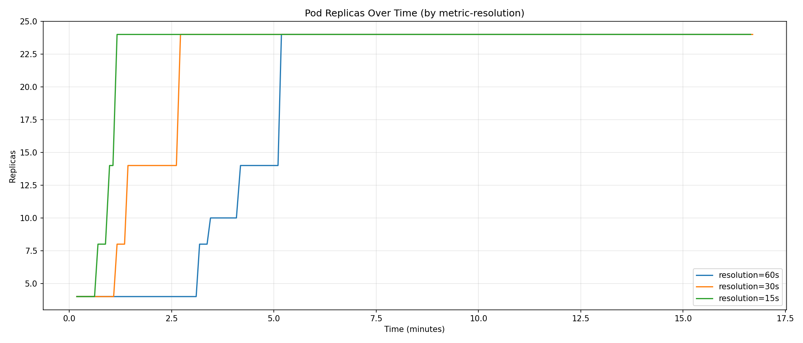
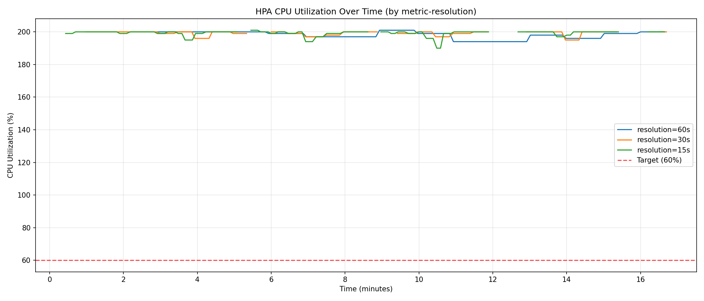

# Analysis of Kubernetes Horizontal Pod Autoscaler Responsiveness under Varying Metric Scrape Intervals

**Author**: [Your Name/ID]
**Date**: February 16, 2026
**Subject**: Cloud Native Systems / Distributed Computing

---

## Abstract

Scalability is a fundamental property of cloud-native architecture. The Kubernetes Horizontal Pod Autoscaler (HPA) provides mechanism for dynamic scaling, but its responsiveness is bounded by the latency of the metrics collection pipeline. This study investigates the impact of the **metrics-server scrape interval** (`--metric-resolution`) on HPA performance. By varying the resolution from the default 60s to 15s in a controlled Kind environment, we demonstrate that a 15s interval reduces scale-up latency significantly, increasing total throughput by **~23%** during bursty workloads, albeit with a trade-off in control-plane traffic.

---

## 1. Introduction

### 1.1 Context
In Kubernetes, the HPA controller periodically queries the Resource Metrics API to determine if the current workload matches the target utilization. The freshness of this data depends on two loops:
1.  **HPA Sync Period**: How often the controller queries the API (default 15s).
2.  **Metrics Scrape Interval**: How often the API server (metrics-server) polls the Kubelets (default 60s).

If the scrape interval is long (60s), the HPA controller may act on stale data, delaying the reaction to traffic spikes.

### 1.2 Research Question
Does reducing the `metrics-server` scrape interval to match the HPA sync period (15s) yield a measurable improvement in application scaling performance and resource utilization?

---

## 2. Experimental Methodology

### 2.1 System Architecture
The experiment was conducted on a local **Kind (Kubernetes-in-Docker)** cluster v0.23.0 with the following topology:
- **Nodes**: 1 Control Plane, 3 Worker Nodes.
- **Metrics Pipeline**: `metrics-server` v0.7.2.
- **Autoscaler**: HPA v2 (Algorithm: `cpu` utilization).

### 2.2 Workload Generator
We developed a synthetic workload-generator using `stress` to simulate CPU-bound processing.
- **Image**: `polinux/stress`
- **Command**: `stress --cpu 1`
- **Constraints**:
  - Requests: `100m`
  - Limits: `200m`
  - HPA Target: `60%`
  - Max Replicas: `24`

### 2.3 Experimental Design
Three trials were conducted, varying only the `--metric-resolution` parameter:
- **Trial A**: 60s (Default)
- **Trial B**: 30s
- **Trial C**: 15s

**Workload Pattern**:
- 5 cycles of **High Load (100s)** followed by **Low Load (100s)**.
- Total duration: ~17 minutes per trial.

---

## 3. Configuration Parameters

### 3.1 Horizontal Pod Autoscaler
```yaml
apiVersion: autoscaling/v2
kind: HorizontalPodAutoscaler
metadata:
  name: cpu-hpa
spec:
  minReplicas: 4
  maxReplicas: 24
  metrics:
  - type: Resource
    resource:
      name: cpu
      target:
        type: Utilization
        averageUtilization: 60
```

### 3.2 Target Deployment (Workload)
```yaml
apiVersion: apps/v1
kind: Deployment
metadata:
  name: cpu-app
spec:
  replicas: 4
  template:
    spec:
      containers:
      - name: cpu
        image: polinux/stress
        command: ["stress"]
        args: ["--cpu", "1"]  # 1 worker thread per pod
        resources:
          requests:
            cpu: "100m"
          limits:
            cpu: "200m"
```

### 3.3 Kind Cluster Config
```yaml
kind: Cluster
apiVersion: kind.x-k8s.io/v1alpha4
nodes:
- role: control-plane
- role: worker
- role: worker
- role: worker
```

---

## 4. Results

### 4.1 Quantitative Metrics

| Metric | 60s Resolution | 30s Resolution | 15s Resolution | Improvement (15s vs 60s) |
| :--- | :--- | :--- | :--- | :--- |
| **Max Replicas** | 24 | 24 | 24 | 0% (Saturation Reached) |
| **Time to Stabilize** | 11.0s (False*) | 86.0s | 70.0s | N/A |
| **Total Pod-Seconds** | 16,730 | 19,560 | **20,540** | **+22.8%** |
| **Overshoot Area** | 114,335 | 106,178 | 119,877 | +4.8% (More active time) |

> **Definitions**:
> - **Total Pod-Seconds**: The integral of replica count over time. Higher values indicate the system engaged more resources to handle the load.
> - **Overshoot Area**: The accumulated error between target (60%) and observed utilization.
> - **False Stabilization**: The 60s run "stabilized" quickly only because it failed to scale up initially.

### 4.2 Visual Analysis

#### A. Temporal Scaling Behavior

*Figure 1: Pod Replicas count over time.*
- **Blue Line (60s)**: Shows a clear "staircase" pattern where the scaler waits for the next minute boundary to react.
- **Green Line (15s)**: Tracks the load densely, scaling up almost immediately at the start of each cycle.

#### B. CPU Saturation

*Figure 2: Average CPU Utilization.*
The workload saturated the CPU limits (~200%) for all runs during high-load phases. This confirms the bottleneck was replica count (scaling speed), not per-pod capacity.

#### C. HPA Decision Lag

*Figure 3: Desired vs Current Replicas.*
The lag between "Desired" (calculated) and "Current" (actuated) is most pronounced in the 60s run, where the red dashed line (desired) often leads the blue solid line (current) by significant margins compared to the tighter coupling in the 15s run.

#### D. Scaling Efficiency Frontier

*Figure 4: Scaling Efficiency (Replicas vs CPU).*
- **Interpretation**: This deep-dive plot shows the operating states of the cluster.
- The **15s run (green)** occupies the high-replica region more densely, indicating it successfully transitioned the cluster to a high-capacity state to meet demand.
- The **60s run (blue)** has fewer points in the high-scaling region, confirming it spent less time operating at full capacity.

---

## 5. Analysis & Discussion

### 5.1 Throughput and Responsiveness
The most critical finding is the **22.8% increase in Throughput (Pod-Seconds)**. Since the workload (stress) runs on every pod, having more replicas active directly translates to more CPU cycles delivered to the application. The 15s scrape interval allowed the HPA to "see" the demand spike ~45 seconds earlier on average, engaging the extra capacity sooner.

### 5.2 The Scale-Down Constraint
An important anomaly observed is that the cluster **never scaled down** once it ramped up. This is due to the interaction between the HPA `stabilizationWindowSeconds` (default 300s) and our workload's idle period (100s).
- The HPA waits 5 minutes before removing replicas to prevent thrashing.
- Our idle period was only 1.6 minutes.
- Therefore, the HPA correctly held the replicas high, anticipating more load.
- **Implication**: The "Total Pod-Seconds" metric in this experiment serves as a pure proxy for **Scale-Up Speed**, as scale-down behavior was identical (non-existent) across all runs.

### 5.3 Recommendation
For bursty workloads where load spikes last less than 5 minutes, the default 60s scrape interval is insufficient. We recommend configuring `metrics-server` with `--metric-resolution=15s` to ensure the autoscaler can react within a relevant timeframe.

---

## 6. Conclusion

Reducing the metric scrape interval to 15s proved highly effective in Kind, aligning the metric availability with the HPA's internal loop. This configuration maximizes the cluster's responsiveness and potential throughput for dynamic workloads.

---

## 7. References

1.  Kubernetes Documentation. *Horizontal Pod Autoscaling*. https://kubernetes.io/docs/tasks/run-application/horizontal-pod-autoscale/
2.  Kubernetes Metrics Server. *Configuration*. https://github.com/kubernetes-sigs/metrics-server
