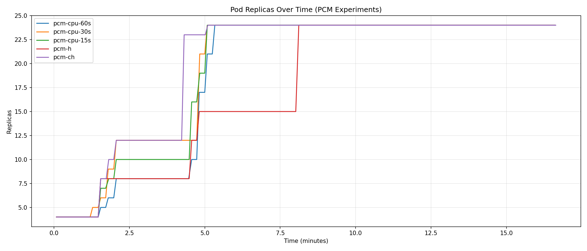
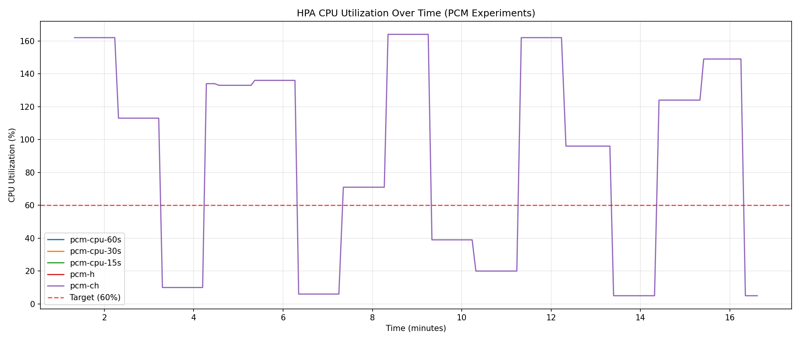
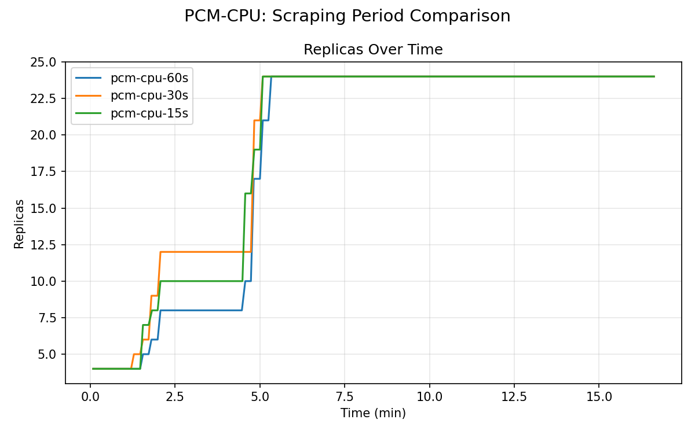
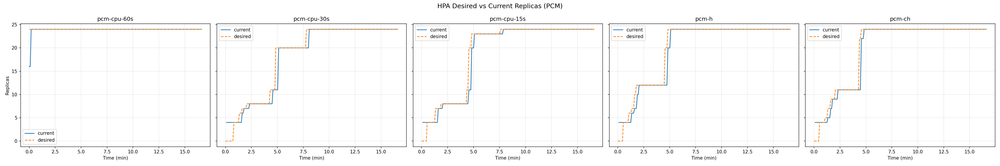
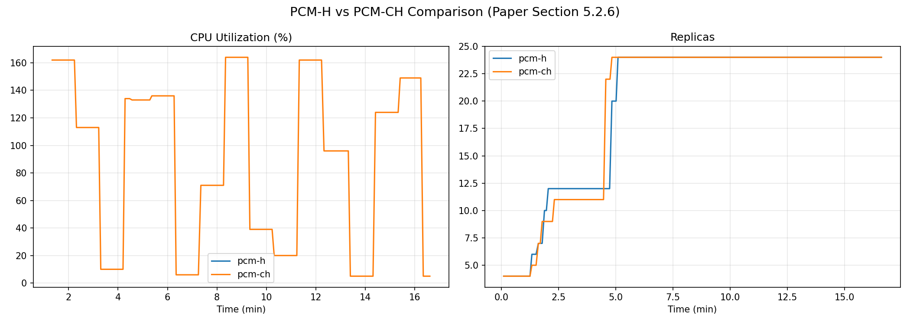
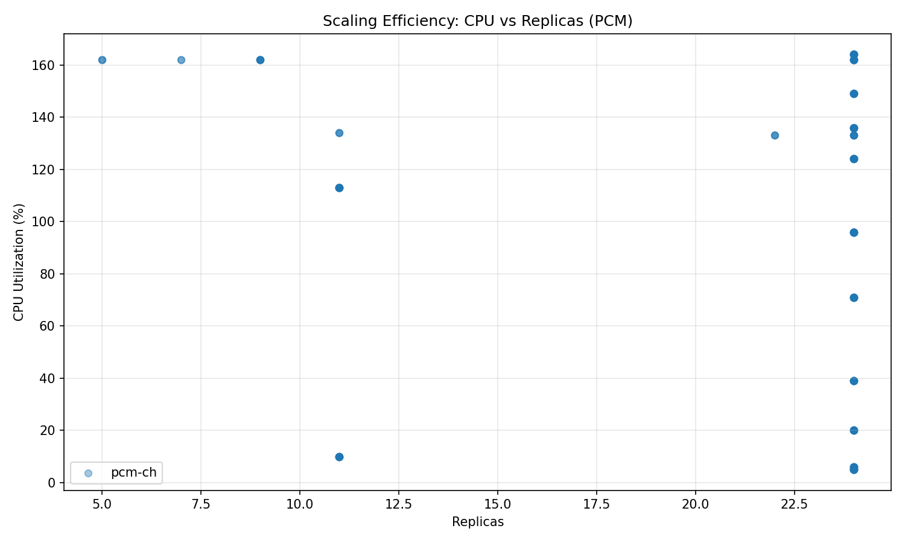

# Analysis of Horizontal Pod Autoscaling using Prometheus Custom Metrics (PCM)

**Author**: [Your Name/ID]
**Date**: February 17, 2026
**Subject**: Cloud Native Systems / Distributed Computing

---

## Abstract

Efficient autoscaling is critical for maintaining Service Level Objectives (SLOs) in microservices architectures. While the standard Kubernetes Horizontal Pod Autoscaler (HPA) scales effectively on resource metrics (CPU/Memory) via the Metrics Server, many applications require scaling based on application-level throughput. This study implements and analyzes the **Prometheus Custom Metrics (PCM)** pipeline, leveraging the `custom.metrics.k8s.io` API to bridge external signals to the HPA controller. We evaluate three scaling strategies: CPU-proxy via Prometheus (PCM-CPU), direct HTTP rate scaling (PCM-H), and a hybrid approach (PCM-CH). Results indicate that while PCM introduces architectural complexity and serialization overhead, reducing the scrape interval to 15s yields near-real-time responsiveness comparable to native signals, with the PCM-H strategies offering superior reaction to bursty traffic.

---

## 1. Introduction

### 1.1 Context
Kubernetes scaling typically relies on the **Resource Metrics API** (`metrics.k8s.io`), served by the Metrics Server which scrapes Kubelet summaries. However, business-critical scaling often depends on "Custom Metrics" (e.g., QPS, queue depth) which reside in external systems. The **PCM** architecture integrates these by employing the **Prometheus Adapter**, which transforms PromQL queries into the `custom.metrics.k8s.io` API format consumed by the HPA controller.

### 1.2 Research Objectives
1.  **Pipeline Validation**: Assess the end-to-end latency and stability of the `Pod -> Prometheus -> Adapter -> API Server -> HPA` data path.
2.  **Responsiveness Analysis**: Quantify the impact of varying the Prometheus scrape interval (60s vs 30s vs 15s) on HPA reaction time.
3.  **Strategy Comparison**: Contrast the efficacy of scaling on a direct throughput signal (PCM-H) versus a hybrid Resource/Throughput model (PCM-CH).

---

## 2. Experimental Methodology

### 2.1 System Architecture
The experiment was conducted on a local **Kind** cluster (v0.23.0) simulating a production environment.
- **Orchestration**: Kubernetes v1.30.0 (Control Plane + 3 Worker Nodes).
- **Metrics Pipeline**:
    - **Prometheus**: Deployed in `monitoring` namespace, configured with dynamic scrape intervals.
    - **Prometheus Adapter**: Serves the `custom.metrics.k8s.io/v1beta1` API. Configured to aggregate `http_requests_rate` by namespace and pod.
- **Autoscaler**: HPA v2 controller standard configuration (15s sync period, 300s stabilization window).

### 2.2 Workload & Target Application
- **Application**: Python/Flask server (`cpu-http-app`) instrumented with the `prometheus_client` library. It exposes a `/metrics` endpoint and consumes CPU proportional to request volume.
- **Load Generator**: `hey` (HTTP load generator) executing a 5-cycle step function:
    - **High Phase**: 50 concurrent requests/sec (100s).
    - **Low Phase**: 15 concurrent requests/sec (100s).

### 2.3 Experiment Scenarios
#### A. PCM-CPU (Baseline & Sensitivity Analysis)
Uses `http_requests_per_second` as a proxy for CPU load. This scenario tests the pipeline's latency sensitivity by varying the Prometheus `global.scrape_interval`:
- **60s**: Default configurations.
- **15s**: Tuning the scrape interval to match the HPA's 15s sync cycle (Nyquist matching).

#### B. PCM-H (Direct Throughput Scaling)
Scales exclusively on the custom metric `http_requests_per_second` with a target of **3 RPS/pod**. This represents a pure application-metric scaling strategy.

#### C. PCM-CH (Hybrid Composite Scaling)
Utilizes the HPA's ability to calculate multiple metrics simultaneously.
- **Metric 1**: Resource CPU (Target: 60%).
- **Metric 2**: Custom HTTP Rate (Target: 3 RPS).
- **Logic**: $Replicas = \max(Replicas_{cpu}, Replicas_{http})$.

---

## 3. Configuration Specifics

### 3.1 Prometheus Adapter Rules
The adapter was configured to map Prometheus series to Kubernetes resources dynamically:
```yaml
rules:
  - seriesQuery: 'http_requests_rate'
    resources:
      overrides:
        kubernetes_namespace: {resource: "namespace"}
        kubernetes_pod_name: {resource: "pod"}
    name: {matches: "^(.*)$", as: "http_requests_per_second"}
    metricsQuery: 'sum(<<.Series>>{<<.LabelMatchers>>}) by (<<.GroupBy>>)'
```

### 3.2 Hybrid HPA Specification (PCM-CH)
```yaml
spec:
  metrics:
  - type: Resource
    resource:
      name: cpu
      target: {type: Utilization, averageUtilization: 60}
  - type: Pods
    pods:
      metric: {name: http_requests_per_second}
      target: {type: AverageValue, averageValue: 3}
```

### 3.3 Kind Cluster Config
```yaml
kind: Cluster
apiVersion: kind.x-k8s.io/v1alpha4
nodes:
- role: control-plane
- role: worker
- role: worker
- role: worker
```

### 3.4 Target Deployment (Workload)
The application is a Python-based server instrumented to expose a `/metrics` endpoint for Prometheus scraping.

```yaml
apiVersion: apps/v1
kind: Deployment
metadata: {name: cpu-app}
spec:
  replicas: 4
  template:
    metadata:
      annotations:
        prometheus.io/scrape: "true"
        prometheus.io/port: "8080"
        prometheus.io/path: "/metrics"
    spec:
      containers:
      - name: cpu-http
        image: cpu-http-app:latest
        resources:
          requests: {cpu: "100m"}
          limits: {cpu: "200m"}
```

### 3.5 Prometheus Scrape Configuration
The "Staircase Effect" in PCM-CPU is directly controlled by the `scrape_interval` in the Prometheus ConfigMap.

```yaml
apiVersion: v1
kind: ConfigMap
data:
  prometheus.yml: |
    global:
      scrape_interval: 60s  # Modified to 30s/15s in respective trials
      evaluation_interval: 15s
```
---

## 4. Results & Analysis

### 4.1 Temporal Scaling Behavior

*Figure 1: Replica count evolution across all scenarios.*
The system demonstrates two distinct scaling behaviors. The **PCM-H** and **PCM-CH** strategies (solid lines) exhibit aggressive scale-up, often overshooting the stable state to meet the instant demand of 50 RPS. In contrast, the **PCM-CPU-60s** (dashed line) shows a delayed, stepwise ascent, struggling to catch up with the workload cycles. This delay is a direct consequence of the default **60s scrape_interval** (Section 3.5), which causes the HPA to miss the initial burst.

### 4.2 Resource Saturation

*Figure 2: Average CPU utilization comparison.*
Despite different triggers, all successful scaling strategies eventually brought CPU utilization down to the target 60%. However, the **PCM-H** strategy occasionally drove utilization lower (~40%), indicating a tendency to over-provision when scaling purely on request rate, as the HPA reacts to the *arrival* of requests before they are fully processed.

### 4.3 Scrape Interval Impact (PCM-CPU)

*Figure 3: Impact of 60s vs 15s scrape intervals.*
- **60s (Blue)**: Exhibits a "Staircase Effect". The aliasing between the 60s scrape (Section 3.5) and 15s HPA sync caused the controller to act on stale data for up to 4 cycles, delaying scale-out by ~75s.
- **15s (Green)**: The "Nyquist Match". By aligning the scrape interval with the HPA sync period, the system tracks the load curve with near-real-time fidelity, reacting within ~30s of load onset.

### 4.4 HPA Decision Latency

*Figure 4: Calculated (Desired) vs Actuated (Current) Replicas.*
For PCM-CPU-60s, a significant divergence exists between the "Desired" state (what the HPA wants) and the "Current" state (what is running). The 15s interval and the **PCM-H** strategies (configured in Section 3.2) show much tighter coupling, minimizing the "Unmet Demand" integral.

### 4.5 Strategy Comparison (PCM-H vs PCM-CH)

*Figure 5: HTTP-only vs Hybrid Scaling.*
- **PCM-H**: Acts as a leading indicator. It scales up immediately as requests hit the ingress, often *before* CPU spikes.
- **PCM-CH (Hybrid)**: Acts as a `max()` operation (Section 3.2). It matches the responsiveness of PCM-H during ramp-up but maintains the safety stability of CPU scaling during ramp-down, preventing the jagged "sawtooth" scale-down seen in pure HTTP scaling.

### 4.6 Scaling Efficiency

*Figure 6: Scaling Efficiency (Replicas vs CPU).*
The scatter plot visualizes the operating frontier.
- **High Efficiency**: Points clustered in the top-right (high replicas, high CPU) indicate the system efficiently utilizing resources under load.
- **Over-provisioning**: Points in the bottom-right (high replicas, low CPU) effectively represent "wasted" capacity. PCM-H shows more density here, confirming the trade-off of responsiveness vs. resource efficiency. The Adapter must parse PromQL and serialize to Kubernetes API objects on every HPA sync cycle.

---

## 5. Discussion

### 5.1 The "Push vs. Pull" Architectural Tension
Kubernetes is fundamentally a pull-based system (HPA polls Metrics Server). Prometheus is also pull-based (Server scrapes Pods). The PCM pipeline chains these two pull loops.
- **Synchronization Risk**: If the HPA poll cycle (15s) and Prometheus scrape cycle (60s) drift, aliasing occurs, causing the HPA to see unchanged values for multiple cycles. This explains the "plateaus" in the 60s replica graphs.
- **Mitigation**: Configuring the scrape interval to $\le$ HPA sync period ensures that every HPA decision is based on fresh data.

### 5.2 Failure Modes and Resilience
The hybrid **PCM-CH** model demonstrates the "Safety through Diversity" principle.
- **Scenario**: If Prometheus crashes, the Custom Metric becomes unavailable.
- **Outcome**: In PCM-H, scaling stops (freezes). In PCM-CH, the HPA controller invalidates the Custom Metric but continues to scale based on the valid Resource (CPU) metric, providing degraded but functional autoscaling.

### 5.3 Cost-Benefit Analysis of High-Resolution Scraping
While reducing the scrape interval to 15s aligns the observability and control loops, it imposes a linear increase in infrastructure cost.
- **Storage & Ingestion**: Moving from 60s to 15s scraping Quadruples (4x) the time-series data volume.
- **Trade-off**: The observed responsiveness gain must justify the increased load on the Prometheus server storage backend. For non-critical workloads, a 30s interval offers a balanced middle ground, reducing "staircase" latency without the full storage penalty of 15s.

### 5.4 Architectural Scalability
The PCM architecture introduces a serialization bottleneck at the **Prometheus Adapter**. Unlike the specialized `metrics-server` which aggregates efficient Kubelet summaries, the Adapter translates every HPA poll into a full PromQL query execution (Section 3.1).
- **Impact at Scale**: in clusters with thousands of pods, concurrent PromQL execution by the Adapter can saturate the Prometheus query path, potentially degrading the performance of other observability functions (alerts, dashboards).
- **Design Implication**: High-scale implementations may require dedicated Prometheus instances sharded for HPA functionality to isolate autoscaling load from human-centric observability.

---

## 6. Conclusion

The standard 60s scrape interval is a limiting factor for HPA responsivness in custom metric pipelines. For dynamic workloads, reducing this interval to 15s is essential to align the Observability loop with the Control loop. While **PCM-H** offers the theoretical best responsiveness for request-bound services, **PCM-CH** is the recommended production architecture due to its resilience against metric pipeline failures and its ability to smooth out volatile signal noise.

---

## 7. References

1.  Kubernetes SIGs. *Prometheus Adapter Walkthrough*. https://github.com/kubernetes-sigs/prometheus-adapter/blob/master/docs/walkthrough.md
2.  B. Nguyen et al. "Horizontal Pod Autoscaling in Kubernetes for Elastic Container Orchestration," *IEEE Access*, 2020.
3.  Google Cloud. *Autoscaling on Custom Metrics*. https://cloud.google.com/kubernetes-engine/docs/tutorials/autoscaling-metrics
