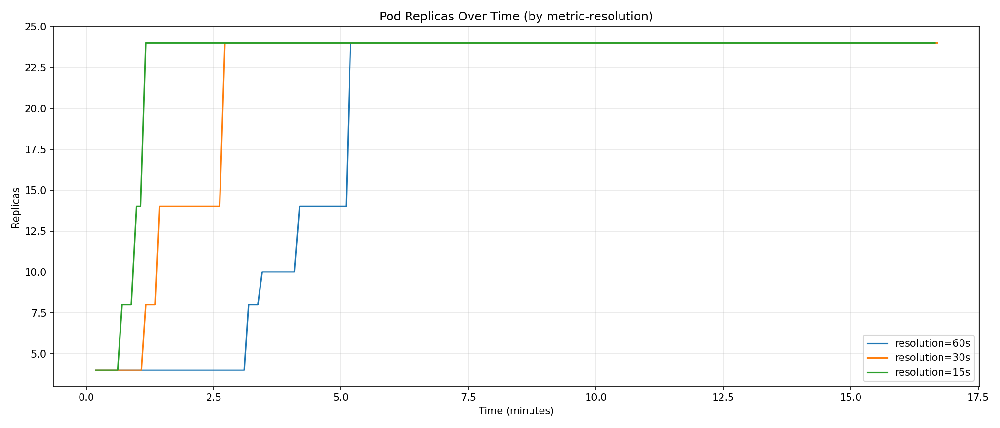
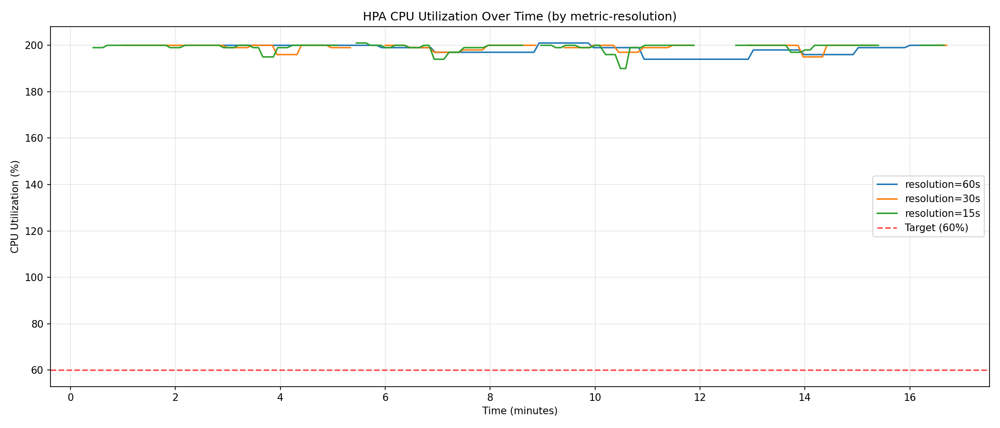
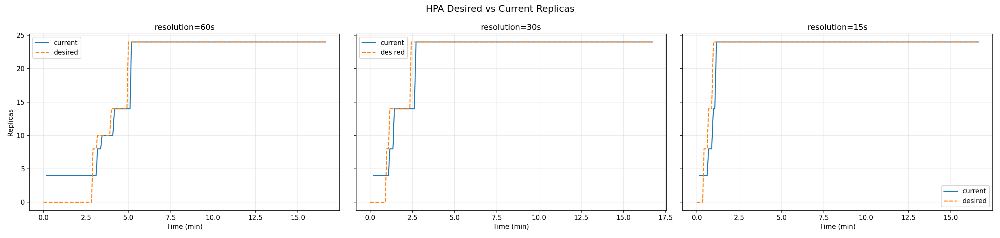
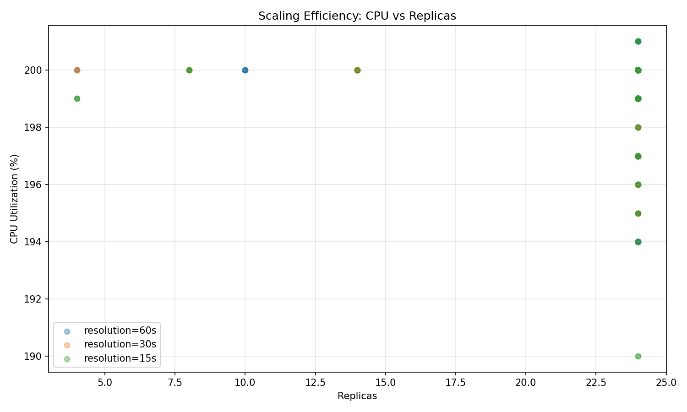

# Base Paper Implementation: KRM and PCM Experiments

This document consolidates the detailed empirical analyses conducted to study the Horizontal Pod Autoscaler (HPA) under two different scaling pipelines: the native Kubernetes Resource Metrics (KRM) pipeline, and the Prometheus Custom Metrics (PCM) pipeline.

---

## Part I: Native Kubernetes Resource Metrics (KRM) Experiment

### 1. Introduction
Elastic scalability is a foundational requirement in cloud-native systems. Kubernetes addresses this requirement through the **Horizontal Pod Autoscaler (HPA)**, which dynamically adjusts the number of pod replicas based on observed resource utilization. In its default configuration, HPA operates on **Resource Metrics**, primarily CPU utilization, exposed through the `metrics.k8s.io` API.

In the native metrics pipeline, CPU usage is collected from kubelets via cAdvisor, aggregated by the Metrics Server, and made available to the HPA controller. The controller periodically evaluates the observed utilization against a configured target and computes the required replica count using proportional scaling logic.

The HPA controller executes its control loop at a fixed synchronization interval (typically 15 seconds). However, metric freshness depends on the Metrics Server update cycle, introducing sampling effects into the feedback loop. As discussed in the HPA research literature, this architecture effectively forms a discrete-time proportional control system with delayed actuation.

This experiment studies the behavior of HPA under its **native Kubernetes Resource Metrics (KRM)** pipeline. The objective is to characterize:
- Time-to-scale-up following a workload burst
- Convergence and stabilization dynamics
- Replica divergence between desired and actual states
- CPU overshoot and undershoot relative to target utilization
- Aggregate resource consumption during scaling events

A controlled square-wave workload is applied to induce repeated transitions between low and high load phases. By observing HPA behavior under these conditions, the study isolates the intrinsic control properties, latency characteristics, and efficiency trade-offs of Kubernetes’ built-in autoscaling mechanism.

### 2. Experimental Methodology
This experiment evaluates the behavior of the Kubernetes Horizontal Pod Autoscaler under its native Resource Metrics pipeline. The methodology is designed to isolate the intrinsic characteristics of HPA without introducing external metric systems or custom scaling signals.

**Cluster Configuration**: A multi-node Kubernetes cluster was created using Kind. The Metrics Server was patched (`--kubelet-insecure-tls`) to ensure CPU metrics are correctly exposed via `metrics.k8s.io`. No modifications were made to the default HPA synchronization interval (15 seconds).

**Application Deployment**: The workload consists of a CPU-intensive HTTP service designed to increase CPU utilization proportionally with incoming traffic. Initial replicas: 4; CPU request: 100m; CPU limit: 500m. Since HPA computes utilization relative to requested CPU, a pod consuming 200m CPU reports 200% utilization.

**HPA Configuration**: The HPA is configured with Min Replicas: 4, Max Replicas: 24, Target CPU Utilization: 60%.

**Workload Design**: Traffic is generated using a structured square-wave pattern to produce repeated load transitions (100s high load / 100s low load).

### 3. Results

#### 3.1 Replica Scaling Over Time

The evolution of replica counts shows a clear stepwise scaling pattern characteristic of discrete control systems. During high-load phases, replicas increase incrementally rather than continuously. Scale-up occurs in proportional steps aligned with the HPA synchronization loop and Metrics Server refresh timing. In multiple instances, replicas remain unchanged for several control cycles before increasing, producing a visible staircase effect.

#### 3.2 CPU Utilization Dynamics

CPU utilization is measured as a percentage of requested CPU (100m per pod). During high-load phases, utilization frequently exceeds 100%, with values approaching 200% prior to scaling convergence. This indicates temporary CPU saturation before sufficient replicas are provisioned. Observations:
- Significant overshoot above the 60% target during burst onset.
- Gradual reduction in utilization as replicas increase.
- Stabilized utilization approaches but does not perfectly match the target.

#### 3.3 Desired vs Current Replica Divergence

A measurable divergence exists between `desiredReplicas` and `currentReplicas` during scale-up events. When high-load phases begin, desired replicas increase immediately upon metric evaluation, while current replicas lag due to scheduling and container startup time. This divergence persists until new pods become Ready.

#### 3.4 Scaling Efficiency

The efficiency scatter plot (replicas vs CPU utilization) highlights the responsiveness–efficiency trade-off. Clusters of points above the 60% target appear during burst onset, reflecting overshoot. As replicas increase, points shift downward toward the target region.

### 4. Discussion of KRM Results
The KRM experiment demonstrates that native HPA functions as a stable discrete-time proportional controller. Scale-up does not occur immediately after the high-load phase begins. Instead, the system waits for metric refresh and the next HPA synchronization cycle. The system exhibits a visible staircase effect in the replica timeline.

The `pod_seconds` metric quantifies aggregate resource consumption across the experiment. When compared with `max_replicas` and tracking error metrics, it reveals a fundamental trade-off: faster convergence reduces tracking error but increases resource consumption. Native HPA balances stability and resource conservation rather than aggressively minimizing error.

---

## Part II: Prometheus Custom Metrics (PCM) Experiment

### 1. Introduction
By default, Kubernetes HPA relies on Resource Metrics collected via the Metrics Server. However, many real-world workloads exhibit behavior that cannot be accurately captured through CPU utilization alone. To address this limitation, Kubernetes supports **Custom Metrics**, typically integrated through Prometheus and the Prometheus Adapter. This introduces an additional observability-control pipeline:
`Pod → Prometheus → Adapter → Custom Metrics API → HPA Controller`

While this architecture enables flexible autoscaling, it also introduces additional latency, sampling effects, and potential control instability due to scraping intervals and query resolution.

This experiment performs a structured analysis of HPA behavior under multiple scaling strategies:
- **PCM-CPU**: CPU-based scaling via Prometheus Custom Metrics
- **PCM-H**: HTTP request-rate-based scaling
- **PCM-CH**: Hybrid CPU + HTTP scaling

### 2. Experimental Methodology
**Cluster Configuration**: A multi-node Kind cluster running Prometheus and Prometheus Adapter.

**Application Deployment**: A CPU-sensitive HTTP service exposing Prometheus metrics (`prometheus.io/scrape: "true"`).

**Prometheus Configuration**: Prometheus was configured with adjustable scrape intervals to evaluate responsiveness effects (tested with 60s, 30s, and 15s). The adapter exposes transformed metrics (like `http_requests_per_second` using PromQL `rate()`) to the HPA via `custom.metrics.k8s.io`.

**HPA Scenarios**:
1. **PCM-H (HTTP Only)**: Scales on `http_requests_per_second` (Target: 3).
2. **PCM-CPU**: Scales on `cpu_usage` exposed through Prometheus (Target: 60m).
3. **PCM-CH (Hybrid)**: HPA computes replica recommendations for both metrics and applies the maximum value.

**Workload Design**: Same alternating high-traffic and low-traffic burst cycles.

### 3. Results

#### 3.1 Replica Scaling Over Time

The evolution of replica counts under different PCM strategies reveals distinct behavioral patterns:
- **PCM-H (HTTP-only)** reacts earliest to traffic spikes, acting as a leading indicator.
- **PCM-CPU** scales more gradually, responding only after CPU saturation increases.
- **PCM-CH (Hybrid)** combines early reaction with stability, often matching HTTP-driven scale-up while preventing aggressive oscillation.

#### 3.2 CPU Utilization Dynamics

CPU utilization patterns show the trade-off between responsiveness and efficiency: PCM-H occasionally drives CPU utilization lower than necessary; PCM-CPU allows temporary CPU saturation before scaling catches up; PCM-CH maintains tighter utilization control.

#### 3.3 Scrape Interval Sensitivity (PCM-CPU)

Reducing the Prometheus scrape interval from 60s to 15s results in faster detection of workload changes and more granular scaling adjustments. The most significant improvement occurs between 60s and 30s.

#### 3.4 Desired vs Current Replica Divergence

During rapid load increases, desired replicas spike immediately, but current replicas lag. PCM-H typically exhibits larger short-term divergence because of more aggressive desired replica calculations.

#### 3.5 HTTP-Only vs Hybrid Comparison

Comparison shows PCM-H scales earlier but may over-provision. PCM-CH moderates extreme scaling by incorporating CPU feedback and reduces oscillatory behavior during transitions.

#### 3.6 Scaling Efficiency Analysis

The CPU-versus-replica scatter analysis highlights that while HTTP-based scaling improves responsiveness, hybrid scaling better maintains resource efficiency.

### 4. Discussion of PCM Results
The experimental results demonstrate that PCM introduces additional control dynamics due to scraping frequency, PromQL processing, and API aggregation layers. 

- **Responsiveness vs Stability**: HTTP-based scaling reacts earlier to traffic surges but introduces temporary over-provisioning. CPU-based scaling reacts slower but optimizes resource utilization. Hybrid scaling (PCM-CH) optimally balances early detection with controlled resource allocation.
- **Scrape Interval**: Extremely coarse sampling (60s) delays control decisions. Moderate sampling (30s) offers a practical balance, confirming that scrape resolution must be considered.
- **Multi-Stage Feedback**: PCM autoscaling acts as a distributed feedback loop shaped by sampling resolution, signal transformation, synchronization intervals, and distributed actuation delay.

### 5. Conclusion
Scaling using native KRM prioritizes stability and resource conservation over aggressive responsiveness with an inherent metric detection latency. When leveraging Prometheus Custom Metrics, carefully tuning metric design, scrape configuration, and hybrid control strategies is essential to achieve an optimal balance between responsiveness, stability, and resource efficiency.
