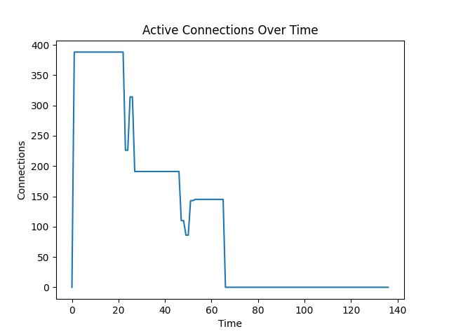
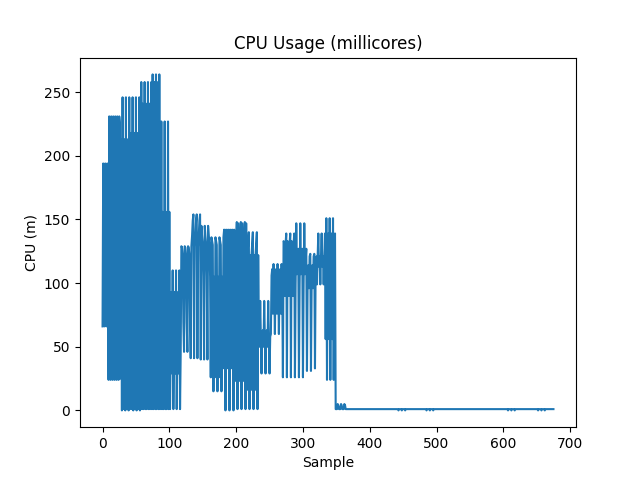
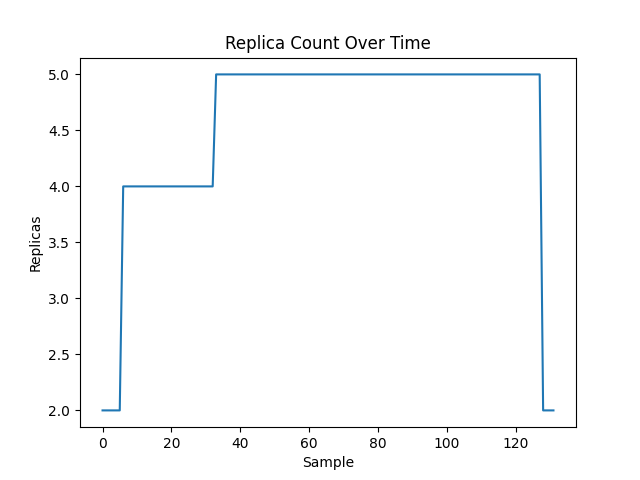

# Experiment-A — CPU-Based HPA Baseline (WebSocket Workload)

## 1. Overview

This experiment establishes the baseline behavior of the default Kubernetes Horizontal Pod Autoscaler (HPA) when applied to a persistent WebSocket workload under monotonic load.

The goal is not to demonstrate failure, but to characterize normal scaling behavior under steady-state conditions. This baseline is required before introducing dynamic churn (Experiment-B) and a stateful autoscaler (Experiment-C).


## 2. Objective

To evaluate how CPU-based HPA responds to a persistent WebSocket connection workload with:

- Gradual load increase
- Sustained high load
- Load removal
- Natural scale-down

This experiment answers:

> How does default Kubernetes HPA behave under steady persistent load?


## 3. Hypothesis

Under monotonic connection load:

- CPU usage will increase proportionally to active connections.
- HPA will scale up based on CPU threshold.
- HPA will respect the stabilization window during scale-down.
- No replica oscillation will occur.
- No reconnection storm will occur.


## 4. System Under Test (SUT)

### Workload
- WebSocket server (persistent TCP connections)
- Stateless application logic
- No session draining logic
- No custom termination hooks

### Cluster
- Fresh `kind` cluster per run
- Multi-node configuration
- metrics-server installed
- Prometheus installed

### Autoscaler
- Kubernetes HPA (autoscaling/v2)
- Metric: CPU utilization
- Target: 60%
- Min replicas: 2
- Max replicas: 10
- Default scale-down stabilization window (300s)


## 5. Load Profile

Single-phase monotonic load:

- 800 WebSocket clients
- Duration: 300 seconds
- Abrupt termination at end of load window

No cyclic or burst pattern is used in this experiment.


## 6. Metrics Collected

The following metrics are logged at 5-second intervals:

- CPU usage (millicores per pod)
- Active WebSocket connections
- HPA replica count
- Pod states
- Prometheus time-series export (active_connections)

All logs are stored under:
```
results/raw/websocket/experiment-a-hpa/
```

Processed outputs are stored under:
```
results/processed/websocket/experiment-a-hpa/
```

## 7. Observed Results

### Active Connections



*The connection graph shows a rapid ramp to approximately 388 active connections as the load generator establishes its sessions. The plateau is held stably for the duration of the sustained load phase. The descent after t≈330s is smooth and gradual — the load generator terminates cleanly, and connections drop to zero without any reconnection spikes. The staircase-like descent reflects natural attrition as individual clients disconnect sequentially. Crucially, there is no overshoot above 388, confirming that no reconnection storm occurred.*

- Rapid ramp-up to ~388 connections.
- Stable plateau during sustained load.
- Gradual, staircase drop after load removal — no reconnection spikes.
- Clean return to zero.

### CPU Usage



*CPU usage climbs proportionally with connection load, peaking at 230–260m per pod when 2 pods handle the full 388-connection load. After HPA scales to 5 pods, per-pod CPU settles to approximately 130m — proportional load distribution working correctly. The abrupt drop to near-zero after load removal (t≈330s) confirms that CPU and connection count are tightly correlated under this workload (CPU_WORK=1). The prolonged near-zero CPU tail corresponds to the 5-minute HPA stabilization window before scale-down.*

- CPU scales proportionally with connection load.
- Peak at load onset: 230–260m (2 pods sharing load).
- Post-scale-up: ~130m/pod (correct load distribution).
- Drops sharply after load removal, then stays near-zero during the stabilization window.

### Replica Count



*The replica graph shows the clean, monotonic scaling that characterises ideal HPA behaviour. The staircase rise from 2 → 4 → 5 replicas follows the CPU signal. The long flat plateau at 5 replicas reflects HPA's default 300-second scaledown stabilization window: the system waits for steady-state CPU to confirm the load has fully dropped before scaling down. The clean return to 2 replicas at the end confirms no oscillation. This is the baseline against which all subsequent experiments are compared.*

- Initial: 2 replicas.
- Scaled to 4 → 5 replicas during load (correct, proportional).
- Remained elevated during 300s stabilization window (by design).
- Returned cleanly to 2 replicas. No oscillation observed.


## 8. Interpretation

Experiment-A demonstrates that:

1. CPU-based HPA behaves correctly under steady persistent load.
2. Scale-up is reactive to CPU increase.
3. Scale-down respects stabilization window.
4. No instability appears under monotonic load.
5. Default HPA is functionally valid in steady-state scenarios.

This confirms that the baseline configuration is stable.


## 9. Limitations of Experiment-A

This experiment does NOT test:

- Abrupt connection churn
- Reconnection storms
- Replica oscillation under bursty load
- Scale-down safety for persistent sessions
- Connection draining behavior

Those aspects are evaluated in Experiment-B.


## 10. Conclusion

Experiment-A establishes a clean and reproducible baseline for CPU-based HPA applied to persistent WebSocket workloads.

The system:

- Scales predictably
- Exhibits no oscillation
- Shows correct stabilization behavior
- Produces stable metrics suitable for comparison

This baseline is required to:

- Demonstrate instability under dynamic churn (Experiment-B)
- Evaluate improvements from a stateful autoscaler (Experiment-C)

Experiment-A is considered successful and complete.