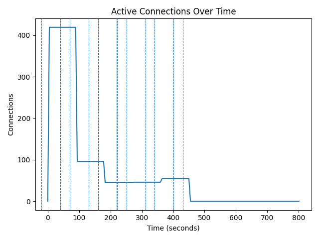
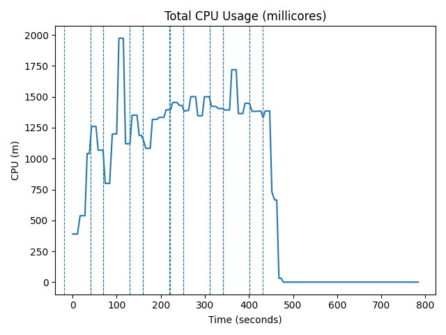
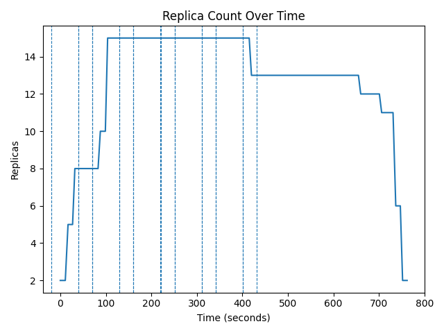

# Experiment-B — CPU-Based HPA Under Dynamic Churn

## 1. Overview

This experiment evaluates the behavior of Kubernetes CPU-based Horizontal Pod Autoscaler (HPA) under cyclic persistent connection load.

Unlike Experiment-A (monotonic load), this experiment introduces dynamic churn to expose instability characteristics.

The workload and autoscaler configuration remain identical to Experiment-A.
Only the load pattern changes.

---

## 2. Objective

To determine how default CPU-based HPA behaves under rapid load cycling in a persistent WebSocket workload.

Specifically, this experiment evaluates:

- Replica oscillation
- Reconnection storms
- CPU spikes during scale transitions
- Reactive scaling instability

---

## 3. Hypothesis

Under cyclic load:

- HPA will scale up during high-load phases.
- HPA will attempt scale-down during low-load phases.
- Abrupt termination of pods with active sessions will induce reconnection bursts.
- CPU spikes will occur during reconnection.
- Replica oscillation will become visible.

---

## 4. Load Pattern

Cyclic load pattern:

- 60 seconds — High load (800 clients)
- 30 seconds — Zero load
- Repeat for 5 cycles

Total duration ≈ 7.5–8 minutes.

This intentionally stresses:

- Scale-up responsiveness
- Scale-down stability
- Control-loop lag

---

## 5. Autoscaler Configuration

Identical to Experiment-A:

- Metric: CPU utilization
- Target: 60%
- Min replicas: 2
- Max replicas: 10
- Scale-down stabilization: 300 seconds

No parameter tuning is performed to preserve fairness.

---

## 6. Metrics Collected

- CPU usage (millicores)
- Active WebSocket connections
- Replica count
- Phase transitions (high/low markers)
- Prometheus time-series export

Raw logs stored under:

results/raw/websocket/experiment-b-hpa-churn/

Processed results stored under:

results/processed/websocket/experiment-b-hpa-churn/

---

## 7. Observed Results

### Active Connections

*Unlike Experiment A's clean plateau, the connection graph shows a sawtooth-like descending staircase. After the initial burst to ~419 connections, connections step down in chunks as the cyclic load pattern forces repeated HIGH/LOW transitions and the over-provisioned HPA begins to shed connections during scale-down events. By t≈430s, connections have fully dropped to zero, but the descent is not a clean ramp — the staggered drops correspond to pods being terminated at different times during the slow, multi-step scale-down. The dashed vertical lines mark HIGH/LOW phase boundaries.*

- Initial burst to **419** connections, then descends in a staggered staircase.
- No clean plateau — cyclic churn prevents stability.
- Connections reach zero only after ~430s (long over-provisioning tail).
- No reconnection storm visible — scale-down was slow enough that individual client disconnects were sequential.

### CPU Usage

*The CPU graph remains persistently elevated throughout the experiment, peaking at ~2,000m aggregated total during the early cycles and holding above 1,000–1,400m across most of the mid-experiment period. This is the CPU "floor" caused by HPA being locked at maxReplicas=15: even with low load from the cyclic pattern, 15 pods each consuming idle CPU adds up to a large aggregate baseline. The final drop to near-zero below t≈480s corresponds to complete load removal. The jagged shape reflects the cyclic HIGH/LOW switching — each HIGH phase drives a CPU spike, but the 5-minute stabilization window prevents scale-down before the next HIGH arrives.*

- CPU persistently elevated, peaks ~2,000m aggregate.
- Never reaches near-zero during LOW phases (too many idle replicas).
- Jagged cyclic pattern from alternating HIGH/LOW phases.
- Final drop only after complete load removal.

### Replica Count

*This is the definitive plot of HPA over-provisioning under cyclic load. HPA climbs rapidly from 2 to 15 replicas (maxReplicas) within the first two cycles and stays there for the entire mid-experiment period — never scaling back down during the LOW phases because the 5-minute stabilization window is longer than the 60-second LOW phase. The system is permanently stuck at maximum capacity. Only after all load is removed does the slow, 11-minute descent from 15 → 13 → 12 → 11 → 6 → 2 begin. At no point during the active load period does HPA make a correct scale-down decision.*

- Climbs to **maxReplicas=15** within the first ~99 seconds.
- Stays locked at 15 throughout all active cycles — never scales down during LOW phases.
- Slow descent: 15 → 13 → 12 → 11 → 6 → 2 takes **~650 seconds** after load removal.
- HPA never reaches a stable, appropriate replica count during the active experiment.

This experiment demonstrates that default CPU-based HPA is stable under steady load (Experiment A)
but over-provisions permanently under dynamic persistent connection churn.

---

## 8. Conclusion

Experiment B1 provides justification for implementing a stateful autoscaler in Experiment C.