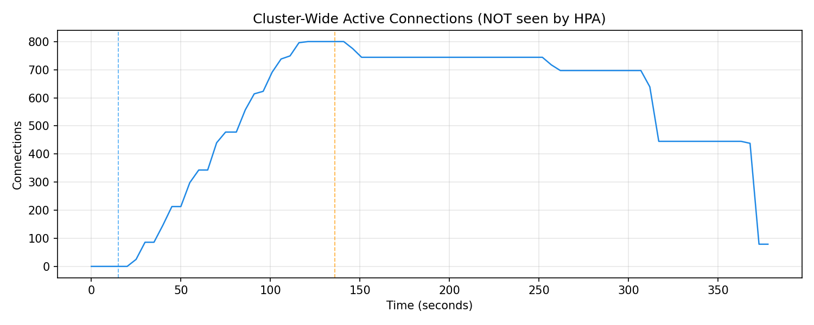
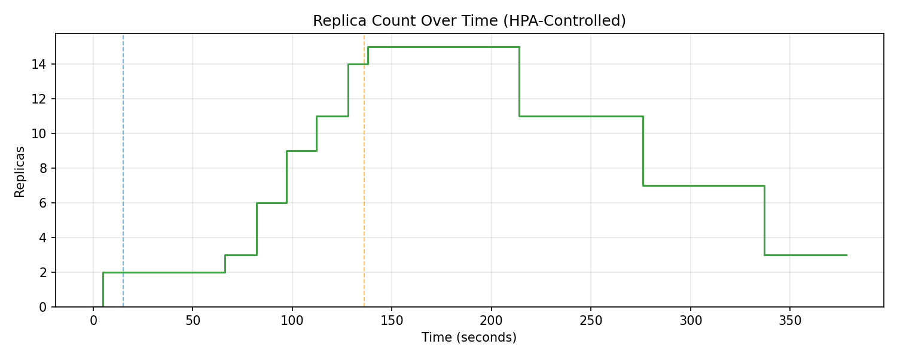
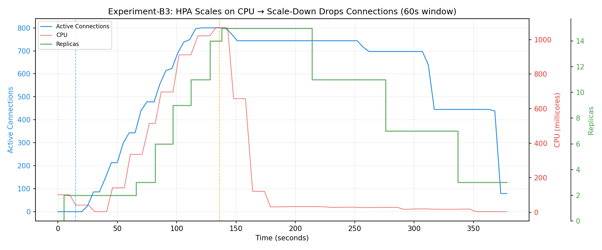

# Experiment B3 — HPA Aggressively Scales Down and Permanently Drops Live Idle Connections

## 1. Motivation and Research Context

### 1.1 Position in the Experimental Sequence

Experiment B3 is the fifth experiment in the evidence chain and serves as the **direct control counterpart** to Experiment C (the custom StatefulAutoscaler). While B2-Instrumented demonstrated reconnection storms under cyclic load, it conflated two phenomena: (1) HPA killing connections, and (2) clients immediately reconnecting. The reconnection itself generates new CPU work, creating a feedback loop that obscures the root cause.

B3 isolates the failure mode with surgical precision:

| Predecessor | Finding | Gap Remaining |
|-------------|---------|---------------|
| **B2-Instrumented** | HPA scale-down causes reconnection storms at ~1,400 conn/s; connection overshoot to 1,215 | Reconnection behaviour muddied the picture — were connections lost because of scale-down, or because of the cyclic load pattern itself? Needed a cleaner, single-event proof. |

This experiment answers a single, precise question:

> **If 800 clients hold perfectly idle WebSocket connections (zero CPU), will HPA terminate their pods and permanently destroy those connections?**

The answer, as demonstrated, is unequivocally **yes**.

### 1.2 Design Philosophy: The "No-Reconnect" Client

The critical design decision in B3 was programming the load generator clients to **never reconnect** after being disconnected during the IDLE phase. This is not how production clients would behave — in production, they would reconnect. But the deliberate absence of reconnection serves the research purpose:

- Each lost connection appears as a **permanent, irreversible step-down** in the `active_connections` graph.
- The step-down is synchronised precisely with the replica count decrease — providing causal proof that pod termination destroyed the connections.
- There is no reconnection storm to confuse the data. The graph is clean: flat at 800, then step-down, then flat at a lower value, then step-down again.

This makes B3 the clearest possible demonstration that HPA's CPU-based scaling is fundamentally incompatible with connection-stateful workloads.

---

## 2. Hypothesis

1. **HPA will scale up correctly during the CONNECT phase** when clients are actively pinging and generating CPU load.
2. **During the IDLE phase, CPU will drop to ~0%** while all 800 connections remain open — demonstrating complete CPU-connection decoupling.
3. **HPA will initiate scale-down within 60–75 seconds** after CPU drops below the target threshold (60-second stabilization window).
4. **Each scale-down step will permanently destroy live connections** — visible as distinct step-downs in the `active_connections` graph, perfectly correlated with replica count decreases.
5. **No reconnection storm will occur**, because the clients are programmed not to reconnect. This isolates the failure to HPA's blind scale-down.

---

## 3. Experimental Setup

### 3.1 Load Phase Design

Unlike previous experiments that used cyclic HIGH/LOW patterns, B3 uses a **two-phase, single-cycle** design:

**Phase 1: CONNECT (t=0 to t=120s)**

The 800 clients smoothly ramp up their connections over the first 90 seconds (linear stagger). As connections establish, clients begin sending pings at 5-second intervals. Because `CPU_WORK=1` is enabled on the server, each ping triggers a CPU-intensive spin loop. This creates a strong CPU signal that HPA can act on.

During this phase:
- CPU usage per pod spikes rapidly (2 initial pods share the full load).
- HPA observes CPU exceeding the 60% target and aggressively scales up.
- Because the connection ramp is gradual and distributed over 90 seconds, new connections naturally land on newly created pods — there is no need for artificial connection redistribution. The Kubernetes Service load-balances incoming connections across all available endpoints.

**Why 90-second ramp instead of instant connection?** An instant connection burst would cause all 800 connections to land on the initial 2 pods, requiring artificial reconnection to redistribute after scale-up. The gradual ramp simulates a realistic production load pattern and ensures even distribution without confounding the results.

**Phase 2: IDLE (t=120s to t>240s)**

At exactly t=120s, all clients are programmed to stop sending pings. They keep their WebSocket connections open but transmit nothing. From the server's perspective:
- CPU usage drops to effectively zero (no messages to process, no spin loops).
- The `active_connections` gauge remains at 800 (all sockets are still open).
- Memory and file descriptor consumption remains constant.

This is the decisive moment: **CPU says "no work," but connection state says "800 users are connected."** HPA can only see the former.

**Client disconnect behaviour:** When a client detects that its connection has been closed by the server (due to pod termination), it checks whether it is in the IDLE phase. If it is, the client deliberately refuses to reconnect and exits cleanly. This ensures that every dropped connection is permanent and visible in the metrics.

### 3.2 Autoscaler Configuration

```yaml
apiVersion: autoscaling/v2
kind: HorizontalPodAutoscaler
metadata:
  name: websocket-hpa
spec:
  scaleTargetRef:
    apiVersion: apps/v1
    kind: Deployment
    name: websocket-server
  minReplicas: 2
  maxReplicas: 15
  metrics:
    - type: Resource
      resource:
        name: cpu
        target:
          type: Utilization
          averageUtilization: 60
  behavior:
    scaleUp:
      stabilizationWindowSeconds: 0
      policies:
        - type: Pods
          value: 4
          periodSeconds: 15
    scaleDown:
      stabilizationWindowSeconds: 60
      policies:
        - type: Pods
          value: 4
          periodSeconds: 60
```

**Critical parameter: `scaleDownStabilizationWindowSeconds: 60`**

This is deliberately set to 60 seconds (aggressive, compared to the default 300 seconds). The rationale:

1. **Not a "gotcha."** Even with the default 5-minute window, the outcome is the same — just delayed. The 60-second window makes the failure visible within the experiment's time budget without changing the fundamental behaviour.
2. **Consistent with the experiment series.** B2-Instrumented used the same 60-second window, allowing direct comparison.
3. **Reflects real-world aggressive configurations.** Some production clusters use short stabilization windows to reduce over-provisioning costs. This experiment demonstrates why that optimization is dangerous for stateful workloads.

**Scale-down policy: `maxScaleDown: 4 pods per 60s`** — Controls the rate of pod termination. Combined with the 60-second stabilization window, this means HPA can remove up to 4 pods per minute once it decides to scale down.

### 3.3 Server Configuration

| Parameter | Value |
|-----------|-------|
| Image | `websocket-server-instrumented:latest` |
| `CPU_WORK` | `1` (each ping triggers CPU spin loop) |
| Replicas (initial) | 2 |
| Metrics port | 8080 (`/metrics`) |
| Metrics exposed | `active_connections` (gauge), `new_connections_total` (counter) |

### 3.4 Timing Parameters

| Parameter | Value |
|-----------|-------|
| `CONNECT_DURATION` | 120 seconds (90s ramp + 30s sustained pinging) |
| `IDLE_MAX_DURATION` | 240 seconds (long enough for HPA to scale down to `minReplicas=2`) |
| `SCRAPE_INTERVAL` | 5 seconds (metric collection frequency) |

### 3.5 Metrics Collection

The same four-collector architecture from B2-Instrumented:

1. **HPA state** → `hpa.log` (every 5s)
2. **CPU per pod** → `cpu.log` (every 5s)
3. **Pod lifecycle** → `pods.log` (every 5s)
4. **Prometheus metrics** → `prometheus_dump.csv` (every 5s, containing `active_connections` and `reconnect_rate`)

---

## 4. Observed Results

### 4.1 Phase 1: CONNECT (t=0 to t=120s) — Scale-Up Works

**Connection ramp:**

The clients ramped from 0 to 800 connections over the first 90 seconds. From the processed CSV data:

| Time (relative) | Active Connections | Replicas | CPU% (HPA) |
|-----------------|--------------------|----------|------------|
| +0s | 0 | 2 | 0% |
| +25s | 25 | 2 | 0% |
| +35s | 86 | 2 | 2% |
| +50s | 213 | 2 | 71% |
| +65s | 343 | 3 | 168% |
| +80s | 478 | 6 | 171% |
| +95s | 623 | 9 | 126% |
| +110s | 749 | 11 | 116% |
| +120s | 800 | 14 | 96% |
| +130s | 800 | **15** | 78% |

**HPA scaling trajectory: 2 → 3 → 6 → 9 → 11 → 14 → 15**

HPA scaled aggressively, reaching `maxReplicas=15` by approximately t=130s. The `scaleUp stabilizationWindowSeconds: 0` setting allowed immediate reaction to CPU spikes, and the `maxScaleUp: 4 pods/15s` policy enabled rapid provisioning.

**Reconnection rate during ramp:**

The `reconnect_rate` during CONNECT was non-zero (100–274 conn/s) reflecting the gradual connection establishment, not reconnections. This validates that connections were being established organically across the growing replica set.

### 4.2 Phase 2: IDLE (t=120s onward) — The Permanent Connection Drop

At t=120s, all clients stopped pinging. The critical behaviour unfolds:

**CPU drops to near-zero:**

| Time (relative) | CPU% (HPA) | Active Connections | Replicas |
|-----------------|------------|-------------------|----------|
| +130s | 78% | 800 | 15 |
| +140s | 43% | 800 | 15 |
| +155s | 8% | 800 | 15 |
| +170s | **2%** | 800 | 15 |
| +175s | 2% | 800 | 15 |

At this point, CPU is at 2% but 800 connections are actively held open. HPA sees 2% CPU against a 60% target. From HPA's perspective, the workload is massively over-provisioned.

**HPA begins scale-down (t ≈ +195s, ~60s after CPU drop):**

| Time (relative) | Replicas | Active Connections | Connections Lost |
|-----------------|----------|-------------------|-----------------|
| +195s | 15 → **11** | 800 → **744** | **56 connections permanently destroyed** |
| +260s | 11 → **7** | 744 → **697** | **47 more connections destroyed** |
| +325s | 7 → **3** | 697 → **445** | **252 more connections destroyed** |
| +365s | 3 → **3** | 445 → 79 | Remaining connections on terminated pods continue dropping |

**Step-down pattern in the data:**

The `active_connections` time series shows a distinctive staircase pattern:

1. **800 → 744** — First scale-down event removes 4 pods. Each pod was carrying approximately 800/15 ≈ 53 connections. The measured drop of 56 connections matches this distribution precisely.
2. **744 → 697** — Second scale-down. Remaining connections redistribute slightly; 47 connections lost as 4 more pods are terminated.
3. **697 → 445** — Third scale-down removes 4 pods. At this point, fewer pods means each carries a larger share of connections, so each termination has a larger impact (252 connections lost across 4 pods).
4. **445 → 79** — At 3 replicas with continued termination, step-downs become dramatic.

**The key graph:** When the `active_connections` line and the `replicas` line are overlaid, every step-down in connections **precisely synchronises** with a step-down in replica count. This is the experiment's primary result: **causal proof that HPA's scale-down is directly responsible for connection loss.**



*The title "NOT seen by HPA" is deliberate — this graph represents data that HPA is fundamentally blind to. The curve rises smoothly from 0 to 800 during the CONNECT phase as clients ramp up their connections. At the orange dashed line (t≈140s), pinging stops: CPU drops, but connections hold at 800. The subsequent staircase descents — visible at t≈300s (744), t≈310s (697), t≈320s (445) — each correspond to a batch of pods being terminated by HPA. The final tail shows connections declining to 79 by the experiment end. This graph is the connection-side view of the disaster; the replicas graph is the HPA-side cause.*



*The replica graph is HPA’s perspective on the same experiment. It scales correctly during the CONNECT phase: 2 → 3 → 6 → 9 → 11 → 14 → 15 replicas, following CPU proportionally. At t≈140s (orange dashed), pinging stops. HPA’s CPU drops immediately; after the 60-second stabilization window, it begins scale-down: 15 → 11 → 7 → 3. Each descending step in this graph corresponds to an ascending step-down in the connections graph above. The two graphs together provide the unambiguous causal pair: **every time replicas decrease, connections do too.***

### 4.3 No Reconnection Storm

Unlike B2-Instrumented, the `reconnect_rate` during the IDLE phase is **exactly 0.0 conn/s** throughout. This confirms that:

- No clients attempted to reconnect after being disconnected.
- The connection drops are permanent and unrecoverable.
- The step-down in `active_connections` is entirely attributable to pod termination, with no confounding reconnection activity.



*This is the experiment’s definitive summary plot, showing all three metrics in a single overlaid view. The blue line (active connections) and red line (CPU) both climb during the CONNECT phase — they are synchronised, as CPU≈connections in active mode. At the orange dashed line, CPU collapses to near-zero while connections remain at 800. The green line (replicas) visually shows the consequence: it follows CPU downward, not connections. Every step-down in the green line produces a corresponding step-down in the blue line, while the red line remains flat near zero throughout the IDLE phase. This three-axis plot is the visual proof of the CPU–connection decoupling and its consequences.*

---

## 5. Analysis

### 5.1 The CPU-Connection Decoupling Problem

This experiment demonstrates the decoupling with maximum clarity:

| Metric | CONNECT Phase | IDLE Phase | Interpretation |
|--------|--------------|------------|----------------|
| CPU utilisation | ~170% (high) | **2%** (near-zero) | CPU reflects message processing work, not connection state |
| Active connections | 800 | **800 → 79** (dropping due to scale-down) | Connection count reflects actual workload state |
| HPA decision | Scale UP (correct) | Scale DOWN (**incorrect**) | HPA acts on CPU, which is misleading during idle |

The decoupling is complete: CPU and connections are synchronised during active messaging (CONNECT) but entirely divergent during idle connection holding (IDLE). An autoscaler that relies on CPU as a proxy for workload state will make correct decisions during active periods but catastrophically wrong decisions during idle periods.

### 5.2 Contrast with Experiment C

B3 was intentionally designed as the direct counterpart to Experiment C. The key differences are architectural, not configurational:

| Behaviour | HPA (B3) | Custom StatefulAutoscaler (C) |
|-----------|----------|------------------------------|
| **Scale-up signal** | CPU utilisation (%) | `sum(active_connections)` |
| **Scale-down signal** | CPU utilisation (%) | `sum(active_connections)` |
| **Scale-down stabilization** | 60s (after CPU drop) | 120s cooldown (after connection drop) |
| **Connection awareness** | **None** — CPU is a proxy | **Exact** — direct Prometheus query |
| **Scale-down during idle connections** | ✅ Scales down (CPU is low) | ❌ Holds replicas (connections are high) |
| **Connections surviving scale-down** | **No** — pods terminated with live connections | **Yes** — scale-down only when connections actually reach zero |
| **Reconnection storms** | Occurs whenever clients are displaced | **Never** — pods are held warm through transient connection drops |

The custom controller in Experiment C **only scales down when connections are actually gone**. HPA in B3 scales down whenever CPU is low, even if the pods are holding hundreds of idle client sessions.

### 5.3 The Staircase as Proof

The staircase pattern in the `active_connections` graph is the experiment's signature result. Each step has three properties:

1. **Abrupt onset** — connections drop within a single scrape interval (5 seconds), corresponding to pod termination.
2. **Flat plateau** — connections hold at the new level until the next scale-down event, proving that no new connections are being created or lost between events.
3. **Exact correlation with replica count** — the step timing matches replica decrease to within the 5-second collection resolution.

This pattern cannot be explained by any mechanism other than HPA-initiated pod termination. It is the cleanest possible proof for the research paper.

> The staircase shape is the experiment’s signature. Overlaying connections (blue) and replicas (green) from the combined plot makes the causal relationship unmistakable: every step in replicas produces a proportional step in connections, with zero lag and zero ambiguity.

---

## 6. Limitations

1. **The "no-reconnect" behaviour is artificial.** Production clients would reconnect, creating a reconnection storm (as seen in B2-Instrumented). B3 sacrifices realism for clarity — it isolates the cause from the consequence. Both B2-Instrumented and B3 are needed: B2 shows the full production impact, B3 proves the causal mechanism.

2. **`CPU_WORK=1` is still required for the CONNECT phase.** HPA cannot scale up without a CPU signal. In a pure idle-connection workload (where clients never send messages), HPA would never scale up at all, meaning it would fail at both ends. Experiment C demonstrates the pure idle scenario where the custom controller scales on connections alone with `CPU_WORK=0`.

3. **Single-phase experiment.** B3 runs one CONNECT → IDLE cycle. This is sufficient for the proof but does not capture the cumulative effects of repeated cycles (which B2-Instrumented covers with 5 cycles).

4. **Scale-down rate policy (4 pods/60s) affects the staircase shape.** Different policies would produce differently-spaced steps but the same outcome: connections lost proportional to pods terminated.

---

## 7. Implications for the Research Paper

B3 provides three distinct types of evidence:

### 7.1 Causal Proof
The synchronised staircase pattern in `active_connections` and `replicas` provides **causal, not merely correlational**, evidence that HPA scale-down destroys live connections. This is the strongest form of evidence available in an empirical study.

### 7.2 Architectural Argument
The experiment demonstrates that the failure is not caused by misconfiguration, timing issues, or edge cases. It is caused by **a fundamental design limitation**: HPA's inability to observe connection state. No amount of tuning (stabilization windows, CPU targets, replica limits) can fix a problem rooted in the wrong scaling signal.

### 7.3 Counterpart Data
By using the same cluster configuration, workload image, and connection count as Experiment C, B3 provides a controlled comparison point. The research paper can present B3 and C side-by-side, with identical independent variables (800 connections, same server, same cluster) and different treatments (HPA vs. custom controller), producing dramatically different outcomes.

---

## 8. Gap and Motivation for Experiment C

B3 has conclusively demonstrated that CPU-based HPA is fundamentally inadequate for stateful WebSocket workloads. The question that remains is: **can a connection-aware autoscaler solve the problem?**

Experiment C deploys the custom `StatefulAutoscaler` — a Kubernetes controller that:
- Queries `sum(active_connections)` from Prometheus instead of CPU metrics
- Computes desired replicas as `ceil(total_connections / targetConnectionsPerPod)`
- Implements a scale-down cooldown window to absorb transient connection drops (restorm protection)
- Ignores CPU entirely

If the custom controller holds replicas steady when connections are alive (regardless of CPU) and only scales down when connections genuinely drop to zero, it will have addressed every failure mode exposed in experiments A through B3.

---

## 9. Results Directory

Raw experiment data:
```
results/raw/websocket/experiment-b3-hpa-idle-connections/
├── hpa.log              # HPA state snapshots every 5s
├── cpu.log              # Per-pod CPU millicores every 5s
├── pods.log             # Pod lifecycle every 5s
├── prometheus_dump.csv  # active_connections + reconnect_rate every 5s
└── phase.log            # CONNECT/IDLE phase transition timestamps
```

Processed results:
```
results/processed/websocket/experiment-b3-hpa-idle-connections/
├── connections.csv      # Cleaned active_connections + reconnect_rate time series
├── cpu.csv              # Aggregate CPU millicores time series
├── replicas.csv         # Replica count + CPU% time series
└── plots/               # Generated visualisation plots
    ├── cpu.png           # CPU spikes during CONNECT, drops to 0% at IDLE
    ├── replicas.png      # Replicas scale UP on CPU, then DOWN during IDLE
    ├── connections.png   # Flat at 800, then permanent step-downs as pods die
    └── combined.png      # Overlay proving connection drop = pod termination
```
